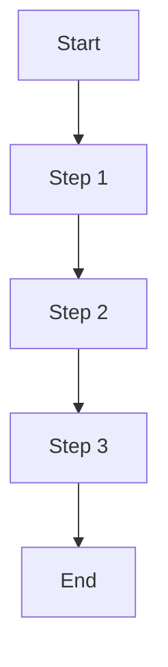

# Create Explanation Documentation

## Function
Create understanding-oriented explanation documentation following the Diátaxis framework

## Trigger Condition
When user inputs `/explanation`

## Behavior
Create a document that meets Diátaxis explanation standards, helping users understand concepts, principles, and context

## Diátaxis Classification
- **User State**: Learning mode (seeking understanding)
- **Knowledge Type**: Understanding-oriented (concept comprehension)
- **Purpose**: Deep comprehension and insight

## Explanation Characteristics
- **User State**: Learning mode, seeking understanding
- **Goal**: Deep comprehension and insight
- **Approach**: Conceptual explanation and analysis
- **Focus**: Understanding and context
- **Tone**: Educational, analytical, thought-provoking

## Document Structure Template

```markdown
# [Concept] Explanation

## What is [Concept]
Definition and basic meaning of [concept]

## Why [Concept] is Needed
- [Problem solved 1]
- [Value provided 1]
- [Application scenario 1]

## How [Concept] Works
[Detailed explanation of how the concept works]

### Core Mechanisms
1. [Mechanism 1]: [Detailed explanation]
2. [Mechanism 2]: [Detailed explanation]
3. [Mechanism 3]: [Detailed explanation]

### Workflow


## Related Concepts
- **[Related concept 1]**: [Relationship explanation]
- **[Related concept 2]**: [Relationship explanation]
- **[Related concept 3]**: [Relationship explanation]

## Practical Applications
### Application Scenario 1: [Scenario Name]
- **Background**: [Scenario background]
- **Application**: [How to apply]
- **Effect**: [Expected effect]

### Application Scenario 2: [Scenario Name]
[Repeat above structure]

## Best Practices
- [Practice recommendation 1]
- [Practice recommendation 2]
- [Practice recommendation 3]

## Common Misconceptions
**Misconception 1**: [Incorrect understanding]
**Correct Understanding**: [Correct explanation]

**Misconception 2**: [Incorrect understanding]
**Correct Understanding**: [Correct explanation]

## Further Learning
- [Advanced learning resource 1]
- [Related topic 1]
- [Practice project suggestions]
```

## Writing Guidelines

### 1. Understanding-Oriented
- Focus on promoting understanding
- Provide in-depth analysis and explanation
- Help users build conceptual frameworks

### 2. Depth
- Provide in-depth analysis and explanation
- Explain principles and mechanisms
- Provide rich context

### 3. Contextual
- Provide necessary background knowledge
- Explain the history and development of concepts
- Describe application scenarios and value

### 4. Inspiring
- Inspire user thinking
- Provide different perspectives
- Encourage deep exploration

## Quality Checklist
- [ ] Clear concept definition
- [ ] In-depth principle explanation
- [ ] Rich background information
- [ ] Practical application scenarios
- [ ] Related concept relationships
- [ ] Best practice recommendations
- [ ] Common misconception clarification
- [ ] Further learning resources

## Usage Example

```
/explanation Create an explanation document about microservices architecture
```

This will generate a document to help users deeply understand microservices architecture, including concept definition, working principles, application scenarios, and best practices.
