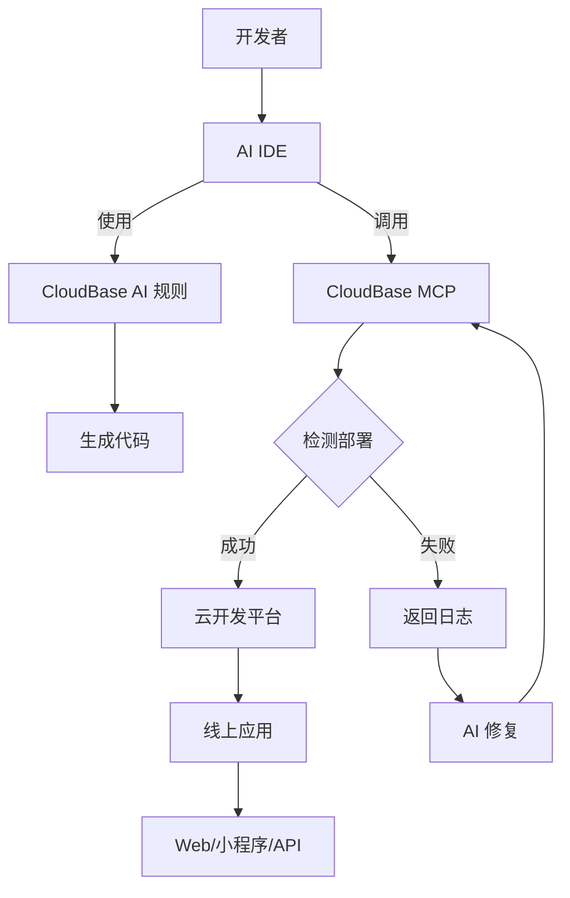

import IDEIconGrid from './components/IDEIconGrid';
import PromptScenarios from './components/PromptScenarios';
import TutorialsGrid from './components/TutorialsGrid';

# AI 原生开发

CloudBase AI Toolkit 通过 MCP 协议连接你的 AI 开发工具（如 Cursor、CodeBuddy）与 CloudBase 平台，实现 AI 原生开发体验。

**AI 原生开发意味着：**

- 用自然语言描述需求，AI 自动完成从代码生成到应用部署的完整流程
- 在 AI 对话中直接操作云服务，创建数据库、部署云函数、配置静态托管，无需手动操作控制台
- 基于错误日志智能修复问题，让开发过程更加流畅

AI 负责代码生成和问题修复，CloudBase 提供运行环境。两者结合，让你专注于业务逻辑，而非基础设施配置。

## CloudBase MCP 

支持的 IDE

<IDEIconGrid />

## CloudBase AI 提示词

<PromptScenarios />

## 核心能力

连接后，你的 AI IDE 将获得以下能力：

- **数据库开发**：智能创建数据表、编写 CRUD 代码
- **云函数开发**：智能编写函数代码
- **智能修复**：基于日志报错信息智能修复问题
- **领域知识**：内置 CloudBase、微信小程序等专业知识库

  

## 视频教程

想通过视频学习如何使用 CloudBase AI ToolKit？查看我们的视频教程和实战案例：

<TutorialsGrid />

## 工作原理

## 开源地址

**Git 仓库：**

- **GitHub**: [https://github.com/TencentCloudBase/CloudBase-AI-ToolKit](https://github.com/TencentCloudBase/CloudBase-AI-ToolKit)
- **CNB**: [https://cnb.cool/tencent/cloud/cloudbase/CloudBase-AI-ToolKit](https://cnb.cool/tencent/cloud/cloudbase/CloudBase-AI-ToolKit)

## 技术交流

### CloudBase AI Coding 交流群

 
<i>扫码加入CloudBase AI Coding 交流微信群</i>

