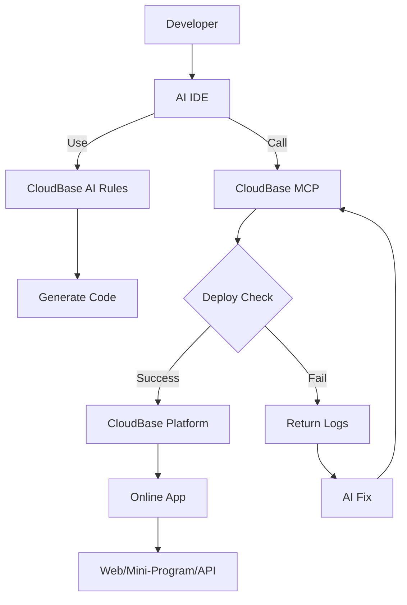

<div align="center">


# 🌟 CloudBase AI ToolKit

**🪐 Instantly generate, deploy, and host your full-stack Web apps, mini-programs, databases, and backend services with AI IDE—no DevOps required, launch your ideas at lightning speed 💫**

**🌍 Languages:** **English** | [中文](https://github.com/TencentCloudBase/CloudBase-AI-ToolKit/blob/main/README-ZH.md)

[](https://opensource.org/licenses/MIT)
[](https://www.npmjs.com/package/@cloudbase/cloudbase-mcp)
[](https://www.npmjs.com/package/@cloudbase/cloudbase-mcp)
[](https://github.com/TencentCloudBase/CloudBase-AI-ToolKit/stargazers)
[](https://github.com/TencentCloudBase/CloudBase-AI-ToolKit/network/members)

[](https://github.com/TencentCloudBase/CloudBase-AI-ToolKit/issues)
[](https://github.com/TencentCloudBase/CloudBase-AI-ToolKit/pulls)
[](https://github.com/TencentCloudBase/CloudBase-AI-ToolKit/commits)
[](https://github.com/TencentCloudBase/CloudBase-AI-ToolKit/graphs/contributors)
[](https://cnb.cool/tencent/cloud/cloudbase/CloudBase-AI-ToolKit)
[](https://deepwiki.com/TencentCloudBase/CloudBase-AI-ToolKit)

When coding in **Cursor/VSCode GitHub Copilot/WinSurf/CodeBuddy/Augment Code/Claude Code/OpenAI Codex CLI** and other AI programming tools, it automatically helps you generate deployable full-stack apps + mini-programs, and publish them to Tencent CloudBase with one click.

**📹 Full Video Demo ⬇️**

<a href="https://www.bilibili.com/video/BV1hpjvzGESg/" target="_blank">
  
</a>

| 🚀 **Core Capabilities** | 🛠️ **Supported Platforms** |
|---|---|
| 🤖 **AI-Powered Development**: AI auto-generates code and architecture<br>☁️ **Cloud Integration**: One-click access to database, cloud functions, static hosting<br>⚡ **Rapid Deployment**: Full-stack apps online in minutes | **Web Apps**: Modern frontend + static hosting<br>**WeChat Mini-Programs**: Cloud-native mini-program solutions<br>**Backend Services**: Cloud database + serverless functions + cloud hosting |

📚 [Quick Start](https://docs.cloudbase.net/ai/cloudbase-ai-toolkit/getting-started) | 🛠️ [IDE Setup](https://docs.cloudbase.net/ai/cloudbase-ai-toolkit/ide-setup/) | 🎨 [Project Templates](https://docs.cloudbase.net/ai/cloudbase-ai-toolkit/templates) | 📖 [Development Guide](https://docs.cloudbase.net/ai/cloudbase-ai-toolkit/development) | 🎮 [Use Cases](https://docs.cloudbase.net/ai/cloudbase-ai-toolkit/examples) | 🎓 [Tutorials](https://docs.cloudbase.net/ai/cloudbase-ai-toolkit/tutorials) | 🔌 [Plugin System](https://docs.cloudbase.net/ai/cloudbase-ai-toolkit/plugins) | 🔧 [MCP Tools](https://docs.cloudbase.net/ai/cloudbase-ai-toolkit/mcp-tools) | ❓ [FAQ](https://docs.cloudbase.net/ai/cloudbase-ai-toolkit/faq)

</div>

## ✨ Key Features

- **🤖 AI-Native** - Rule library designed for AI programming tools, generates code following CloudBase best practices
- **🚀 One-Click Deploy** - MCP automated deployment to Tencent CloudBase platform, Serverless architecture without server management
- **📱 Full-Stack Apps** - Web + Mini-programs + Database + Backend integration, supports multiple app types and backend hosting
- **🔧 Smart Debugging** - AI automatically reviews logs and fixes issues, reducing operational costs
- **⚡ Lightning Fast** - Domestic CDN acceleration, faster access than overseas platforms
- **📚 Knowledge Retrieval** - Built-in intelligent vector search for CloudBase and WeChat Mini-Program professional knowledge bases

- **🎯 Flexible Workflow** - Support for /spec and /no_spec commands, intelligently choose development mode based on task complexity

> [!TIP]
> 
> 🚩 Built-in Spec Workflow: Make AI programming more engineering-oriented
> 
> - Built-in Kiro-style Spec workflow, supports Cursor, Claude Code, and other mainstream AI IDEs
> - Clear requirements, design, and tasks, auto-generates requirements.md, design.md, tasks.md
> - Move beyond "slot machine" vibe coding, development process is controllable and traceable
> - Let AI assist in sorting out requirements, design solutions, and task breakdowns, while humans focus on decision-making and review
- **Spec workflow is built into CloudBase AI rules**, download the latest template or let AI download CloudBase AI rules in the current project to get it

---
🚩 **Get Started with CloudBase AI ToolKit**

## 🚀 Recommended: CloudBase AI CLI (Simplest)

CloudBase AI CLI is a unified command-line tool that integrates multiple mainstream AI programming tools, supporting built-in models and custom models. It allows you to use Claude Code, OpenAI Codex, aider, Qwen Code, and other AI programming assistants with a simple command, while built-in CloudBase AI Toolkit supports the complete workflow from development to deployment, and can run in any environment.

**Core Advantages:**
- 🏗️ **Unified Management** - One command to manage multiple AI programming CLI tools, no need to switch between tools
- 🤖 **Multi-Model Support** - Support for built-in and custom large models, including Kimi K2, Zhipu GLM-4.5, etc.
- 🚀 **One-Click Development & Deployment** - Complete workflow from code generation to cloud deployment, supporting Web apps, mini-programs, and backend services
- 🌍 **Everywhere** - Can run in any environment, including mini-program developer tools, VS Code, GitHub Actions, etc.

**One-Click Installation**
```bash
# Mac/Linux/Windows WSL
curl https://static.cloudbase.net/cli/install/install.sh -fsS | bash

# Windows PowerShell
irm https://static.cloudbase.net/cli/install/install.ps1 | iex
```

**Start Using**
```bash
tcb ai
```

On first launch, the configuration wizard will guide you through AI tool selection and configuration. After configuration, you can start using AI tools for assisted development. You can run `tcb ai --setup` later to switch tools and models.

👉 [View complete usage documentation](https://docs.cloudbase.net/cli-v1/ai/introduce) | [Try Now](https://docs.cloudbase.net/cli-v1/ai/introduce) | [Full-Stack Mini-Program Development Case Tutorial](https://docs.cloudbase.net/practices/ai-cli-mini-program)

## 🛠️ Other IDE Configuration Methods

If you use other AI IDEs, please refer to the configuration guides below:

---

## 🚀 Quick Start

### 0. Prerequisites

<details>
<summary>Install an AI development tool</summary>

For example, [Cursor](https://www.cursor.com/) | [WindSurf](https://windsurf.com/editor) | [CodeBuddy](https://copilot.tencent.com/), etc. See the [Supported AI IDE List](#2-configure-your-ai-ide).

</details>

<details>
<summary>Enable CloudBase Environment</summary>

Visit the [Tencent CloudBase Console](https://tcb.cloud.tencent.com/dev) to enable your environment. New users can try it for free.

</details>

<details>
<summary>Install Node.js v18.15.0 or above</summary>

Make sure your computer has Node.js v18.15.0 or above. Download the latest version from the [Node.js official site](https://nodejs.org/).

</details>

<details>
<summary>Optional: Set npm registry</summary>

To speed up dependency downloads, set npm registry to Tencent mirror. Run in your terminal:

```bash
npm config set registry https://mirrors.cloud.tencent.com/npm/
```

This will speed up downloads, especially in mainland China.
</details>

<details>
<summary>Optional: Clear npx cache</summary>
Due to a bug in npx, you may need to clear its cache if you encounter installation issues. Run:

```
npx clear-npx-cache
```
</details>

### 1. Initialize or Enhance Your Project

We provide project templates with best CloudBase practices and AI IDE rules. Two recommended ways:

#### 🚀 For New Projects

Choose a template and initialize in one click:

- **WeChat Mini-Program + CloudBase**  
  [Download Code](https://static.cloudbase.net/cloudbase-examples/miniprogram-cloudbase-miniprogram-template.zip?v=2025053001) ｜ [Source Code](https://github.com/TencentCloudBase/awesome-cloudbase-examples/tree/master/miniprogram/cloudbase-miniprogram-template)

- **React Web App + CloudBase**  
  [Download Code](https://static.cloudbase.net/cloudbase-examples/web-cloudbase-react-template.zip?v=2025053001) ｜ [Source Code](https://github.com/TencentCloudBase/awesome-cloudbase-examples/tree/master/web/cloudbase-react-template)

- **Vue Web App + CloudBase**  
  [Download Code](https://static.cloudbase.net/cloudbase-examples/web-cloudbase-vue-template.zip?v=2025053001) ｜ [Source Code](https://github.com/TencentCloudBase/awesome-cloudbase-examples/tree/master/web/cloudbase-vue-template)

- **UniApp Cross-Platform + CloudBase**  
  [Download Code](https://static.cloudbase.net/cloudbase-examples/universal-cloudbase-uniapp-template.zip?v=2025053001) ｜ [Source Code](https://github.com/TencentCloudBase/awesome-cloudbase-examples/tree/master/universal/cloudbase-uniapp-template)

- **Universal CloudBase Template**: Not limited to any language or framework, includes CloudBase AI rules and MCP, suitable for any CloudBase project

  [Download Code](https://static.cloudbase.net/cloudbase-examples/web-cloudbase-project.zip) ｜ [Source Code](https://github.com/TencentCloudBase/awesome-cloudbase-examples/tree/master/web/cloudbase-project)

#### 🛠️ Enhance Existing Projects

If you already have a project, after configuring MCP, just tell the AI "Download CloudBase AI rules in the current project" to automatically download and complete the AI editor rule configuration in your project directory.

If you only want to download specific IDE config files to avoid project file confusion, you can specify the IDE type:
```
Download CloudBase AI rules in the current project, only include Cursor config
Download CloudBase AI rules in the current project, only include WindSurf config
Download CloudBase AI rules in the current project, only include Claude Code config
```

### 2. Configure Your AI IDE

> [!TIP]
> If you use a template project, all configs are preset. If not, follow the instructions below to add the required config manually.

All the following tools support CloudBase AI ToolKit. Choose your tool and follow the guide:

| Tool | Platform | Guide |
|------|----------|----------|
| [CloudBase AI CLI](https://docs.cloudbase.net/cli-v1/ai/introduce) | CLI | [Guide](https://docs.cloudbase.net/cli-v1/ai/introduce) |
| [Cursor](https://docs.cloudbase.net/ai/cloudbase-ai-toolkit/ide-setup/cursor) | Standalone IDE| [Guide](https://docs.cloudbase.net/ai/cloudbase-ai-toolkit/ide-setup/cursor) |
| [WindSurf](https://docs.cloudbase.net/ai/cloudbase-ai-toolkit/ide-setup/windsurf) | Standalone IDE, VSCode, JetBrains | [Guide](https://docs.cloudbase.net/ai/cloudbase-ai-toolkit/ide-setup/windsurf) |
| [CodeBuddy](https://docs.cloudbase.net/ai/cloudbase-ai-toolkit/ide-setup/codebuddy) | Standalone IDE (CloudBase built-in), VS Code, JetBrains, WeChat DevTools | [Guide](https://docs.cloudbase.net/ai/cloudbase-ai-toolkit/ide-setup/codebuddy) |
| [CLINE](https://docs.cloudbase.net/ai/cloudbase-ai-toolkit/ide-setup/cline) | VS Code | [Guide](https://docs.cloudbase.net/ai/cloudbase-ai-toolkit/ide-setup/cline) |
| [GitHub Copilot](https://docs.cloudbase.net/ai/cloudbase-ai-toolkit/ide-setup/github-copilot) | VS Code | [Guide](https://docs.cloudbase.net/ai/cloudbase-ai-toolkit/ide-setup/github-copilot) |
| [Trae](https://docs.cloudbase.net/ai/cloudbase-ai-toolkit/ide-setup/trae) | Standalone IDE | [Guide](https://docs.cloudbase.net/ai/cloudbase-ai-toolkit/ide-setup/trae) |
| [Tongyi Lingma](https://docs.cloudbase.net/ai/cloudbase-ai-toolkit/ide-setup/tongyi-lingma) | Standalone IDE, VS Code, JetBrains | [Guide](https://docs.cloudbase.net/ai/cloudbase-ai-toolkit/ide-setup/tongyi-lingma) |
| [RooCode](https://docs.cloudbase.net/ai/cloudbase-ai-toolkit/ide-setup/roocode) | VS Code | [Guide](https://docs.cloudbase.net/ai/cloudbase-ai-toolkit/ide-setup/roocode) |
| [Baidu Comate](https://docs.cloudbase.net/ai/cloudbase-ai-toolkit/ide-setup/baidu-comate) | VS Code, JetBrains | [Guide](https://docs.cloudbase.net/ai/cloudbase-ai-toolkit/ide-setup/baidu-comate) |
| [Augment Code](https://docs.cloudbase.net/ai/cloudbase-ai-toolkit/ide-setup/augment-code) | VS Code, JetBrains | [Guide](https://docs.cloudbase.net/ai/cloudbase-ai-toolkit/ide-setup/augment-code) |
| [Claude Code](https://docs.cloudbase.net/ai/cloudbase-ai-toolkit/ide-setup/claude-code) | CLI | [Guide](https://docs.cloudbase.net/ai/cloudbase-ai-toolkit/ide-setup/claude-code) |
| [Gemini CLI](https://docs.cloudbase.net/ai/cloudbase-ai-toolkit/ide-setup/gemini-cli) | CLI | [Guide](https://docs.cloudbase.net/ai/cloudbase-ai-toolkit/ide-setup/gemini-cli) |
| [OpenAI Codex CLI](https://docs.cloudbase.net/ai/cloudbase-ai-toolkit/ide-setup/openai-codex-cli) | CLI | [Guide](https://docs.cloudbase.net/ai/cloudbase-ai-toolkit/ide-setup/openai-codex-cli) |
| [OpenCode](https://docs.cloudbase.net/ai/cloudbase-ai-toolkit/ide-setup/opencode) | CLI | [Guide](https://docs.cloudbase.net/ai/cloudbase-ai-toolkit/ide-setup/opencode) |
| [Qwen Code](https://docs.cloudbase.net/ai/cloudbase-ai-toolkit/ide-setup/qwen-code) | CLI | [Guide](https://docs.cloudbase.net/ai/cloudbase-ai-toolkit/ide-setup/qwen-code) |

### 3. Start Developing

Before you start, just tell the AI:

```
Login to CloudBase
```
The AI will automatically pop up the Tencent Cloud login and environment selection.

To switch environments later, say:

```
Logout CloudBase
```

The AI will clear the local config. You can ask the AI to login again anytime.

After login, you can confirm the AI is connected:

```
Query current CloudBase environment info
```

Describe your requirements to the AI and start developing:

```
Build a two-player online Gomoku game website, support online battle, and deploy it
```

The AI will automatically:
- 📝 Generate frontend and backend code
- 🚀 Deploy to CloudBase
- 🔗 Return the online access link

If you encounter errors during development, send the error message to the AI for troubleshooting:

```
There was an error: xxxx
```

You can also ask the AI to debug and modify code using cloud function logs:

```
The cloud function code does not meet the requirements, the requirement is xxx, please check the logs and data for debugging and fix it
```

## 🔌 Plugin System

CloudBase MCP uses a plugin architecture. [See detailed docs](https://docs.cloudbase.net/ai/cloudbase-ai-toolkit/plugins)

### Quick Config

```json
{
  "env": {
    "CLOUDBASE_MCP_PLUGINS_ENABLED": "env,database,functions,hosting"
  }
}
```

## 📚 Tutorials

### 📄 Articles

#### 🚀 CloudBase AI CLI Case Studies
- [Develop a Neighborhood Item Recycling Mini-Program with CloudBase AI CLI](https://docs.cloudbase.net/practices/ai-cli-mini-program) - Detailed case tutorial showing how to use CloudBase AI CLI to develop a complete mini-program project from scratch

#### 🌐 Full-Stack Web Apps
- [One-stop development of card flip game with CodeBuddy IDE + CloudBase](https://mp.weixin.qq.com/s/2EM3RBzdQUCdfld2CglWgg)
- [Develop a WeChat mini-game in 1 hour with CloudBase AI Toolkit](https://cloud.tencent.com/developer/article/2532595)
- [AI Coding Power Combo: Cursor + Cloudbase-AI-Toolkit Game Dev](https://juejin.cn/post/7518783423277695028#comment)
- [Launched a co-op Overcooked game in 2 days](https://mp.weixin.qq.com/s/nKfhHUf8w-EVKvA0u1rdeg)
- [CloudBase AI Toolkit: Build a hospital intern scheduling system, goodbye painful excel tables](https://cloud.tencent.com/developer/article/2538023)
- [No server, how to cloud deploy full-stack projects](https://cloud.tencent.com/developer/article/2537971)
- [Quickly create a programmer's exclusive business card website](https://cloud.tencent.com/developer/article/2536273)

#### 📱 Full-Stack Mini-Programs
- [I built a "hot words" mini-program with CloudBase AI ToolKit in one day](https://cloud.tencent.com/developer/article/2537907)
- [Use AI to create your exclusive "cloud library" mini-program!](https://cloud.tencent.com/developer/article/2535789)
- [One person challenges full-stack development resume mini-program](https://cloud.tencent.com/developer/article/2535894)
- [I used AI to develop and launch a mini-program: Worry Relief Box](https://mp.weixin.qq.com/s/DYekRheNQ2u8LAl_F830fA)
- [From zero to full-stack dev in the AI era: Figma + Cursor + Cloudbase for WeChat mini-programs](https://mp.weixin.qq.com/s/nT2JsKnwBiup1imniCr2jA)

### 📱 App Projects
- [Resume Assistant Mini-Program](https://gitcode.com/qq_33681891/resume_template)
- [Gomoku Online Game](https://github.com/TencentCloudBase/awesome-cloudbase-examples/tree/master/web/gomoku-game)
- [Overcooked Co-op Game](https://github.com/TencentCloudBase/awesome-cloudbase-examples/tree/master/web/overcooked-game)
- [E-commerce Admin Panel](https://github.com/TencentCloudBase/awesome-cloudbase-examples/tree/master/web/ecommerce-management-backend)
- [Short Video Mini-Program](https://github.com/TencentCloudBase/awesome-cloudbase-examples/tree/master/miniprogram/cloudbase-ai-video)
- [Dating Mini-Program](https://github.com/TencentCloudBase/awesome-cloudbase-examples/tree/master/miniprogram/dating)

### 🎥 Video Tutorials
- [CloudBase: Use AI to develop an Overcooked game](https://www.bilibili.com/video/BV1v5KAzwEf9/)
- [Software 3.0: Best AI Programming Partner CloudBase AI ToolKit, WeChat Mini-Program Example](https://www.bilibili.com/video/BV15gKdz1E5N/)
- [Use AiCoding to challenge full-stack development resume mini-program](https://www.bilibili.com/video/BV1D23Nz1Ec3/)
- [5 minutes to create a programmer's exclusive business card website locally](https://www.bilibili.com/video/BV19y3EzsEHQ/?vd_source=c8763f6ab9c7c6f7f760ad7ea9157011)

---

## 🎯 Use Cases

### Case 1: Two-Player Online Gomoku

**Development Process:**
1. Input requirement: "Build a two-player online Gomoku website, support online battle"
2. AI generates: Web app + cloud database + real-time data push
3. Auto-deploy and get access link

👉 **Demo:** [Gomoku Game](https://cloud1-5g39elugeec5ba0f-1300855855.tcloudbaseapp.com/gobang/#/)

<details>
<summary>📸 See development screenshots</summary>

| Development | Final Result |
|---------|---------|
|  |  |
|  | Supports two-player online battle<br>Real-time board sync |

</details>

### Case 2: AI Pet Mini-Program

**Development Process:**
1. Input: "Develop a pet-raising mini-program with AI-enhanced interaction"
2. AI generates: Mini-program + cloud database + AI cloud function
3. Import to WeChat DevTools to publish

<details>
<summary>📸 See dev screenshots and mini-program preview</summary>

<table>
<tr>
<td width="50%">
<b>🖥️ Dev Screenshots</b><br>

<br>

</td>
<td width="50%">
<b>📱 Mini-Program Preview</b><br>


<br><br>
<b>📲 Experience QR Code</b><br>

</td>
</tr>
</table>

</details>

### Case 3: Smart Issue Diagnosis

When an app has issues:
1. AI automatically checks cloud function logs
2. Analyzes error causes and generates fix code
3. Auto redeploys

<details>
<summary>📸 See smart diagnosis process</summary>

<div align="center">

<br>
<i>AI auto-analyzes logs and generates fixes</i>
</div>

</details>

---

## 🌟 Why Choose CloudBase?

- **⚡ Lightning Fast Deployment**: Domestic nodes, faster than overseas
- **🛡️ Stable & Reliable**: Trusted by 3.3 million developers
- **🔧 Developer Friendly**: Full-stack platform for the AI era, supports auto environment config
- **💰 Cost-Effective**: Serverless architecture, free for new users during development

## 📋 FAQ

For migration, integration, and other common questions, see the [FAQ](https://docs.cloudbase.net/ai/cloudbase-ai-toolkit/faq).

## 💬 Community

Need help or want to share? Join our community!

### 🔥 WeChat Group

<div align="center">

<br>
<i>Scan to join the WeChat tech group</i>
</div>

**In the group you can:**
- 💡 Share your AI + CloudBase projects
- 🤝 Tech exchange and Q&A
- 📢 Get the latest updates and best practices
- 🎯 Join product discussions and suggestions

### 📱 Other Channels

| Platform | Link | Description |
|------|------|------|
| **Docs** | [📖 Docs](https://docs.cloudbase.net/) | Full CloudBase docs |
| **Issue Feedback** | [🐛 Submit Issue](https://github.com/TencentCloudBase/CloudBase-AI-ToolKit/issues) | Bug reports & feature requests |

### 🎉 Community Events

- **Weekly Tech Sharing**: Best practices for AI + CloudBase
- **Project Showcases**: Show off your AI-powered projects
- **Q&A**: Tencent CloudBase team answers questions
- **Feature Previews**: Try new features first

## 🛠️ CloudBase MCP Tools Overview

There are **39 tools** covering environment management, database, cloud functions, hosting, mini-program publishing, and more.

📋 **Full tool docs**: [See MCP tool details](doc/mcp-tools.md) | [Tool spec JSON](scripts/tools.json)

### 🔧 Tool Categories

| Category | Count | Main Features |
|------|----------|----------|
| 🌍 **Env Mgmt** | 4 | Login, env info, domain mgmt |
| 🗄️ **Database** | 11 | Collection mgmt, CRUD, indexes, data models |
| ⚡ **Cloud Functions** | 9 | Create, update, invoke, logs, triggers |
| 🌐 **Hosting** | 5 | File upload, domain config, site deploy |
| 📁 **File Ops** | 2 | Remote download, cloud storage upload |
| 📱 **Mini-Program** | 7 | Upload, preview, build, config, debug, QA |
| 🛠️ **Tool Support** | 4 | Templates, knowledge search, web search, dialogs |
| 🔌 **HTTP Access** | 1 | HTTP function access |

### 🌟 Tool Highlights

| Type | Name | Highlights |
|----------|----------|----------|
| 🔐 **Auth** | `login` / `logout` | One-click CloudBase login, auto env selection |
| 📊 **Env Query** | `envQuery` | **🔄 Merged Tool** - env list, info, domain in one |
| 🗄️ **Database** | `collectionQuery` | **🔄 Merged Tool** - existence, detail, list mgmt |
| ⚡ **Cloud Functions** | `createFunction` | Full config, auto deps install, trigger setup |
| 🌐 **Hosting** | `uploadFiles` | Batch upload, smart ignore, CDN acceleration |
| 🧠 **AI Enhanced** | `searchKnowledgeBase` | Vector search CloudBase KB, smart Q&A |

### 💡 Tool Optimization

We optimized from 40 to 36 tools, added 3 mini-program debug tools, now 39 tools in total, with better experience via merging and full mini-program toolchain.

🔗 **Want details for each tool?** See [MCP tool docs](doc/mcp-tools.md)

## 🏗️ Architecture



## 🔒 Telemetry

To improve product experience, CloudBase AI ToolKit collects anonymous usage stats:

- **Collected**: Tool calls, basic env info (OS, Node.js version, etc.)
- **Privacy**: No code or file paths collected, only for product improvement

Set `CLOUDBASE_MCP_TELEMETRY_DISABLED=true` to disable telemetry.

## 🤝 Contributing

PRs and issues welcome! See our [Contributing Guide](CONTRIBUTING.md) for how to get involved.

## 📄 License

[MIT](LICENSE) © TencentCloudBase

---

⭐ If you find this project helpful, please give us a Star!

[](https://github.com/TencentCloudBase/CloudBase-AI-ToolKit)

