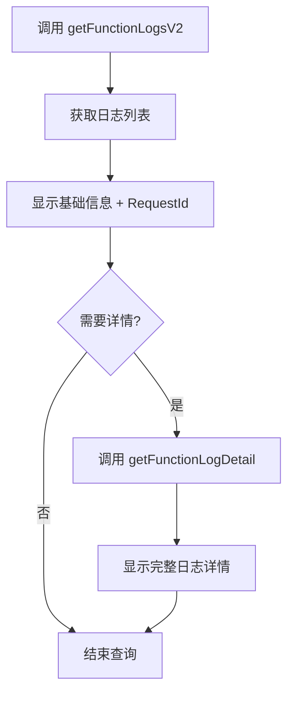

# 🚀 CloudBase AI ToolKit v1.8.40 详细发布公告

<div align="center">

## 🎉 CloudBase AI ToolKit v1.8.40 更新

### 🌟 核心亮点：CloudBase AI CLI 工具集成

</div>

---

## 🚀 CloudBase AI CLI - 开发工具集成

### ✨ 功能特点
新增 CloudBase AI CLI 工具，支持统一管理多种 AI 编程工具，让开发者能够在一个界面中轻松切换和使用各种 AI 编程助手。

### 🎯 适用场景
- **多工具切换烦恼**：需要在 Claude Code、OpenAI Codex、aider 等工具间频繁切换
- **环境配置复杂**：每个 AI 工具都有不同的安装和配置流程
- **模型选择困难**：想要尝试不同的 AI 模型但配置繁琐
- **开发流程不连贯**：AI 编程后还需要手动部署和管理云资源

### 🌟 核心优势

| 优势 | 传统方式 | CloudBase AI CLI |
|------|----------|------------------|
| **工具管理** | 🔄 分别安装配置 | 🏗️ 一键统一管理 |
| **模型支持** | 📋 有限内置模型 | 🤖 支持 Kimi K2、智谱 GLM-4.5 等多种模型 |
| **开发部署** | 🚧 分离的开发部署流程 | 🚀 一键完成代码生成到云端部署 |
| **环境兼容** | 💻 仅支持特定环境 | 🌍 任意环境运行，包括小程序开发者工具、GitHub Actions |

### 💻 快速开始实践

**场景：一键安装和配置**
```
用户：我想开始使用 AI 编程工具
AI：
1. 🔧 自动下载安装 CloudBase AI CLI
2. ⚙️ 引导配置 AI 工具和模型
3. 🚀 启动统一开发环境
4. ✅ 准备就绪，开始开发
```

### 🎯 支持的 AI 编程工具
- **Claude Code** - Anthropic 的 AI 编程助手
- **OpenAI Codex** - OpenAI 的代码生成工具
- **aider** - 基于 GPT 的代码编辑器
- **Qwen Code** - 阿里云的 AI 编程工具
- **CodeBuddy** - 腾讯云的 AI 编程助手（CloudBase CLI 内置支持）
- **美团龙猫** - 美团最新一代 AI 大模型
- **更多工具** - 持续集成主流 AI 编程工具

### 🤖 AI 对话实践

**场景 1：多工具切换**
```
用户：我想用不同的 AI 工具开发一个电商应用
AI：
1. 📋 展示可用 AI 工具列表（包括 CodeBuddy、美团龙猫等）
2. 🔄 让用户选择心仪的工具
3. 🚀 自动切换到选定的工具
4. 💻 开始电商应用开发
```

**场景 2：CloudBase CLI 内置工具**
```
用户：我想用 CodeBuddy 开发小程序
AI：
1. 🎯 识别 CloudBase CLI 内置支持的 CodeBuddy
2. 🔧 自动配置 CodeBuddy 环境
3. 🚀 启动 CodeBuddy 开发模式
4. 📱 开始小程序开发
```

**场景 3：美团龙猫大模型**
```
用户：使用美团龙猫来优化代码性能
AI：
1. 🧠 切换到美团龙猫大模型
2. 📊 分析代码性能瓶颈
3. 🔧 提供优化建议和重构方案
4. ⚡ 生成优化后的代码
```

**场景 4：一键部署**
```
用户：开发完成后直接部署到云端
AI：
1. 📦 打包项目代码
2. ☁️ 自动部署到 CloudBase
3. 🔗 生成访问链接
4. ✅ 应用上线完成
```

### 💡 尝试提示词
```
安装 CloudBase AI CLI 并配置 Claude Code 工具
```
```
使用 AI CLI 开发一个博客系统，支持多用户和评论功能
```
```
用 CodeBuddy 开发一个微信小程序，包含用户登录和数据展示
```
```
使用美团龙猫优化现有代码的性能和可读性
```

---

## 💬 智能交互系统 - 让 AI 更好地理解你的需求

### ✨ 核心价值
新增交互式工具系统，让 AI 助手能够与你进行有效的沟通，特别是在需要澄清需求、确认操作或进行选择时。

### 🎯 适用场景
- 需求描述不够清晰时，AI 会主动询问详细信息
- 执行敏感操作前，AI 会请求用户确认
- 多环境部署时，AI 会提供可视化环境选择
- 复杂任务拆分时，AI 会逐一确认每个步骤

### 🤖 AI 对话实践

**场景 1：需求澄清**
```
用户：帮我创建一个商城应用
AI：我需要更多信息来为你创建合适的商城应用，请问：
- 是 B2C 还是 B2B 模式？
- 需要哪些核心功能（商品展示、购物车、支付等）？
- 预计的用户规模？
```

**场景 2：操作确认**
```
用户：删除生产环境的数据库
AI：⚠️ 你即将删除生产环境的数据库，这是一个高风险操作。
确认要继续吗？(yes/no)
```

### 💡 尝试提示词
```
/spec 创建一个完整的用户管理系统，包括注册登录、权限管理和个人资料管理
```

---

## ☁️ 云托管插件 - 全栈云服务管理专家

### ✨ 核心价值
新增云托管服务管理插件，支持云托管服务的完整生命周期管理，包括服务查询、代码部署、配置管理等。

### 🎯 适用场景
- 快速部署后端服务到云托管
- 管理多个云托管服务的状态和配置
- 下载现有服务代码进行本地开发
- 实现服务的版本管理和回滚

### 🏗️ 架构优势
- **读写分离设计**：查询和部署操作分离，保障数据安全
- **工具数量优化**：仅保留 2-3 个核心工具，避免功能冗余
- **兼容性保证**：完全兼容现有云函数插件的实现模式

### 🤖 AI 对话实践

**场景：部署 Node.js 后端服务**
```
用户：部署我的 Node.js API 服务到云托管
AI：
1. 📦 正在打包项目代码...
2. ☁️ 创建云托管服务实例...
3. 🚀 部署到云端环境...
4. ✅ 部署完成！访问地址：https://xxx.cloudbase.run
```

### 💡 尝试提示词
```
创建一个 Express.js API 服务，包含用户认证和数据 CRUD 操作，部署到云托管
```

---

## 🤖 AI 数据建模 - 智能数据库设计

### ✨ 核心价值
通过自然语言描述业务需求，AI 自动生成专业的 Mermaid ER 图，并基于图表创建真实的 MySQL 数据模型。

### 🎯 适用场景
- 新项目数据库设计阶段
- 业务需求变化时的表结构调整
- 复杂业务关系的数据建模
- 数据库设计的标准化和规范化

### 🔧 技术亮点
- **智能 ER 图生成**：基于业务描述自动生成规范的 Mermaid 图表
- **MySQL 专业支持**：充分利用 MySQL 的强大数据类型特性
- **关联关系处理**：自动识别和建立表间关联关系
- **异步任务监控**：支持大模型创建的进度跟踪

### 🤖 AI 对话实践

**场景：电商系统数据建模**
```
用户：为电商系统设计数据库，包括用户、商品、订单等核心实体
AI：
1. 📊 分析业务需求，识别核心实体和关系
2. 🎨 生成 Mermaid ER 图：

erDiagram
    USER ||--o{ ORDER : places
    PRODUCT ||--o{ ORDER_ITEM : contains
    ORDER ||--|{ ORDER_ITEM : has
    CATEGORY ||--o{ PRODUCT : categorizes

3. 🗄️ 创建对应的 MySQL 数据表
4. ✅ 数据模型创建完成
```

### 💡 尝试提示词
```
设计一个博客系统的数据库模型，包含用户、文章、评论、标签等实体，支持 Mermaid 图表导出
```

---

## 📋 工作流斜杠命令 - 智能开发流程控制

### ✨ 核心价值
新增 `/spec` 和 `/no_spec` 命令，让开发者可以根据任务复杂度灵活选择开发流程。

### 🎯 适用场景
- **复杂项目**：使用 `/spec` 获得完整的开发流程保障
- **简单任务**：使用 `/no_spec` 快速完成小功能
- **智能判断**：无需手动选择，AI 自动识别最适合的流程

### 🔧 命令详解

| 命令 | 适用场景 | 流程特点 |
|------|----------|----------|
| `/spec` | 复杂功能、新架构 | 需求文档 → 技术方案 → 任务拆分 → 执行 |
| `/no_spec` | 简单修复、配置修改 | 直接执行，无文档流程 |
| 自动判断 | 根据任务复杂度 | AI 智能选择最优流程 |

### 🤖 AI 对话实践

**场景 1：复杂功能开发**
```
/spec 开发一个完整的在线教育平台，包括课程管理、学生选课、教师管理等功能
```

**场景 2：简单功能修复**
```
/no_spec 修复登录页面的样式问题
```

### 💡 尝试提示词
```
/spec 创建一个任务管理系统，包含项目管理、任务分配、进度跟踪、团队协作等功能
```

---

## 🔐 统一安全规则管理 - 一站式权限控制

### ✨ 核心价值
新增安全规则插件，支持数据库、云函数、存储的统一权限管理，简化安全配置流程。

### 🎯 适用场景
- 设置数据库的访问权限和数据安全规则
- 配置云函数的调用权限和安全策略
- 管理存储文件的访问控制规则
- 实现多环境的安全策略统一管理

### 🛡️ 安全特性
- **多资源支持**：数据库、云函数、存储一体化管理
- **权限模板**：提供常用权限配置模板
- **规则验证**：自动检查规则语法和逻辑正确性
- **操作审计**：记录所有权限变更操作

### 🤖 AI 对话实践

**场景：配置数据库安全规则**
```
用户：为用户表设置安全规则，只允许用户查看和修改自己的数据
AI：
1. 🔍 分析数据表结构和业务逻辑
2. 📝 生成合适的数据库安全规则
3. 🚀 应用安全规则到数据库
4. ✅ 安全规则配置完成
```

### 💡 尝试提示词
```
设置数据库安全规则，实现用户只能访问自己的数据，管理员可以访问所有数据
```

---

## 🎁 AI 编程邀请码激活 - 开发者激励计划

### ✨ 核心价值
为 AI 编程用户提供邀请码激活功能，参与激励计划获得更多开发资源和支持。

### 🎯 适用场景
- 新用户注册后的奖励激活
- 邀请好友共同开发时的激励
- 参与社区活动获得额外资源
- 开发者成长计划的里程碑奖励

### 💰 激励机制
- **多重奖励**：云资源、开发工具、技术支持
- **累积激励**：邀请越多，奖励越多
- **成长奖励**：根据开发成果获得额外激励
- **社区认可**：优秀项目获得社区展示机会

### 🤖 AI 对话实践

**场景：激活邀请码**
```
用户：激活我的邀请码 ABC123
AI：
1. 🎫 验证邀请码有效性
2. 🎁 激活开发者激励计划
3. 📊 计算可获得的奖励
4. ✅ 激活成功！获得额外云资源和开发工具
```

### 💡 尝试提示词
```
我想激活邀请码，参与 AI 编程激励计划
```

---

## 🔧 多 IDE 全场景支持 - 无缝开发体验

### ✨ 核心价值
持续扩展对主流 AI IDE 的支持，提供一致的开发体验和开发规范。

### 🎯 支持的 IDE
- **CodeBuddy** 🏆 - 推荐，已内置 CloudBase AI Toolkit
- **Cursor** - 专业 AI 编程 IDE
- **WindSurf** - 全栈开发环境
- **Qwen Code** - 阿里云 AI 编程工具
- **OpenCode** - 开源 AI 编程平台
- **通义灵码** - 阿里云 AI 编程助手
- **RooCode** - VS Code AI 插件
- **文心快码** - 百度 AI 编程工具

### 🌟 IDE 特性对比

| IDE | 安装便捷性 | 功能完整性 | 推荐指数 |
|-----|------------|------------|----------|
| CodeBuddy | ⭐⭐⭐⭐⭐ | ⭐⭐⭐⭐⭐ | 🏆 首选 |
| Cursor | ⭐⭐⭐⭐⭐ | ⭐⭐⭐⭐⭐ | ⭐⭐⭐⭐⭐ |
| WindSurf | ⭐⭐⭐⭐⭐ | ⭐⭐⭐⭐⭐ | ⭐⭐⭐⭐⭐ |
| Qwen Code | ⭐⭐⭐⭐ | ⭐⭐⭐⭐⭐ | ⭐⭐⭐⭐ |

### 🤖 AI 对话实践

**场景：IDE 特定配置**
```
用户：在当前项目中下载云开发 AI 规则，只包含 CodeBuddy 配置
AI：
1. 🎯 识别目标 IDE 类型
2. 📁 下载对应的配置文件
3. 🔧 配置项目规则
4. ✅ CodeBuddy 配置完成
```

### 💡 尝试提示词
```
在我的项目中配置 CloudBase AI Toolkit，适配 CodeBuddy IDE
```

---

## 📝 认证规则深度优化 - 安全开发指南

### ✨ 核心价值
明确区分 Web 端和小程序端的认证方式，避免开发者犯错，提升应用安全性。

### 🎯 认证方式对比

#### 🌐 Web 应用认证
- **推荐方式**：使用 `@cloudbase/js-sdk` 的内置认证
- **核心方法**：`auth.toDefaultLoginPage()`
- **优势**：开箱即用，支持多种登录方式
- **适用场景**：Web 应用的用户认证

#### 📱 小程序认证
- **认证特点**：天然免登录
- **获取身份**：云函数中通过 `wxContext.OPENID`
- **优势**：无需额外认证流程
- **适用场景**：微信小程序用户身份获取

### 🤖 AI 对话实践

**场景 1：Web 应用登录**
```
用户：为我的 React 应用添加用户登录功能
AI：
1. 🔍 识别项目类型为 Web 应用
2. 📚 应用认证开发规范
3. 💻 生成使用 SDK 内置认证的代码
4. ✅ 登录功能实现完成
```

**场景 2：小程序身份获取**
```
用户：小程序中如何获取用户身份
AI：
1. 📱 识别项目类型为小程序
2. 📖 说明小程序免登录特性
3. 🔧 生成通过 wxContext 获取 openid 的代码
4. ✅ 身份获取功能实现完成
```

### 💡 尝试提示词
```
为我的 Web 应用实现完整的用户认证系统，包括注册、登录、密码重置
```

---

## 📊 云函数日志 V2 - 专业调试工具

### ✨ 核心价值
升级到新版日志接口，支持按需查询日志详情，提升调试效率和问题排查能力。

### 🎯 技术升级
- **接口升级**：使用 `getFunctionLogsV2` 获取基础日志信息
- **按需查询**：通过 `RequestId` 查询具体日志详情
- **性能优化**：减少不必要的网络请求和数据传输
- **兼容性**：兼容 manager-node 4.4.0+ 版本

### 🔍 日志查询流程



### 🤖 AI 对话实践

**场景：云函数调试**
```
用户：我的云函数运行异常，请查看日志帮我分析问题
AI：
1. 📋 获取云函数日志列表
2. 🔍 识别错误信息和 RequestId
3. 📄 获取详细的错误日志
4. 🔧 分析问题根源并提供修复建议
5. ✅ 问题诊断完成
```

### 💡 尝试提示词
```
云函数报错，请查看完整日志并修复问题
```

---

## 🔧 技术改进

### 系统优化
- 优化日志系统，支持跨平台兼容性和竞态条件修复
- 增强遥测功能，改进错误跟踪和请求 ID 支持
- 重构构建系统，采用模块化 Webpack 配置
- 改进工具文档，增强可读性和参数说明
- 优化数据库工具，支持对象数组参数和嵌套 JSON
- 增强小程序调试工具和微信开发者工具集成

### 问题修复
- 修复 IDE 文件过滤问题，支持特定 IDE 类型
- 解决环境 ID 获取的循环依赖死锁问题
- 修复数据库工具参数序列化和语法错误
- 优化函数部署依赖安装配置
- 改进 README 保护机制和模板下载功能

### 文档更新
- 新增插件系统文档和使用指南
- 优化 FAQ 和故障排除指南
- 增强教程和案例学习资料
- 更新 MCP 工具参考文档

## 🚀 升级指南

### 更新 MCP 工具

**方法一：自动更新（推荐）**
在你的 AI 开发工具的 MCP 列表中，找到 cloudbase 并重新启用或刷新 MCP 列表即可自动安装最新版本。

**方法二：手动更新**
如果自动更新不成功，可以先禁用再重新启用 cloudbase，或者重启你的 AI IDE。

**方法三：使用最新版本**
```json
{
  "mcpServers": {
    "cloudbase": {
      "command": "npx",
      "args": ["npm-global-exec@latest", "@cloudbase/cloudbase-mcp@latest"]
    }
  }
}
```

### 更新项目规则
在项目中对 AI 说：
```
在当前项目中下载云开发 AI 规则
```

或者指定特定 IDE：
```
在当前项目中下载云开发 AI 规则，只包含 Cursor 配置
在当前项目中下载云开发 AI 规则，只包含 WindSurf 配置
在当前项目中下载云开发 AI 规则，只包含 CodeBuddy 配置
```

---

## 🙏 致谢

感谢所有贡献者为 CloudBase AI ToolKit 做出的贡献！

特别感谢社区用户提供的反馈和建议，让我们能够持续改进工具功能。

### 📊 版本统计
- 🎉 **核心功能**：AI CLI 一键集成
- 🔄 **提交次数**：50+ 次代码提交
- ✨ **新功能**：10+ 个重要功能
- 🐛 **问题修复**：20+ 个 bug 修复
- 📚 **文档更新**：15+ 篇文档优化

### 🎁 社区影响力
- 💬 **用户反馈**：积极采纳社区建议
- 🛠️ **工具改进**：基于实际使用场景优化
- 📈 **生态扩展**：支持更多 AI IDE 和开发工具

## 📞 获取帮助和支持

### 📚 学习资源
- [📖 完整文档](https://docs.cloudbase.net/ai/cloudbase-ai-toolkit/)
- [🎯 快速开始](https://docs.cloudbase.net/ai/cloudbase-ai-toolkit/getting-started)
- [💻 开发指南](https://docs.cloudbase.net/ai/cloudbase-ai-toolkit/development)
- [❓ 常见问题](https://docs.cloudbase.net/ai/cloudbase-ai-toolkit/faq)

### 💬 社区交流
- [GitHub Discussions](https://github.com/TencentCloudBase/CloudBase-AI-ToolKit/discussions)
- [腾讯云开发者社区](https://cnb.cool/tencent/cloud/cloudbase/CloudBase-AI-ToolKit)
- [微信开发者社区](https://developers.weixin.qq.com/community/develop/mixflow)

### 🐛 问题反馈
- [GitHub Issues](https://github.com/TencentCloudBase/CloudBase-AI-ToolKit/issues)
- [腾讯云控制台工单](https://console.cloud.tencent.com/workorder)

---

<div align="center">

**⭐ 如果这个项目对你有帮助，请给我们一个 Star！**

[](https://github.com/TencentCloudBase/CloudBase-AI-ToolKit)

</div>

---

**🚀 现在就开始体验 CloudBase AI ToolKit v1.8.40 的更新吧！**
