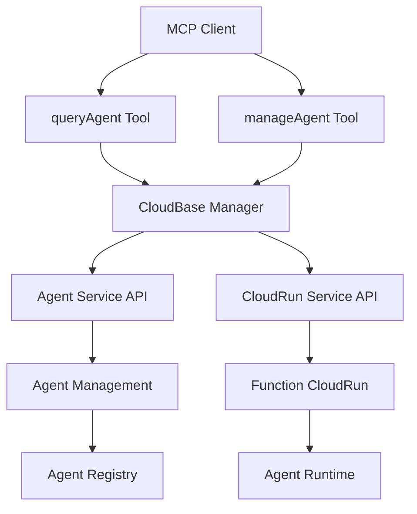
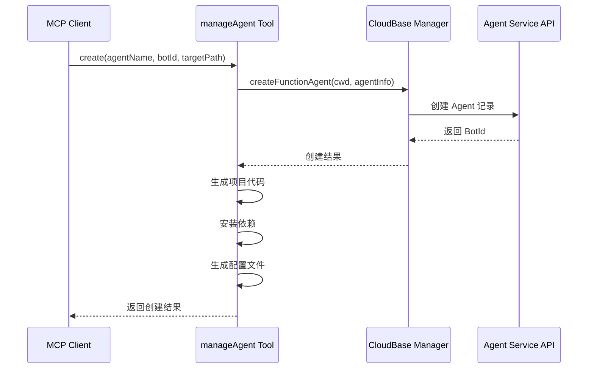
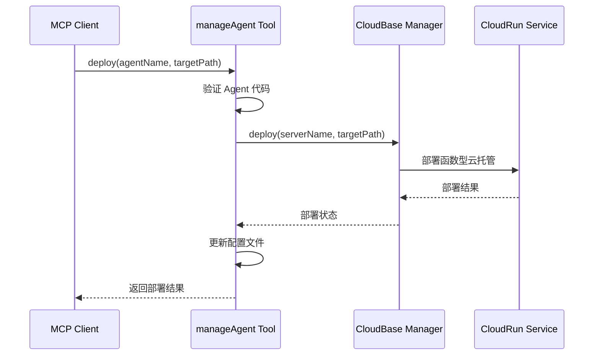
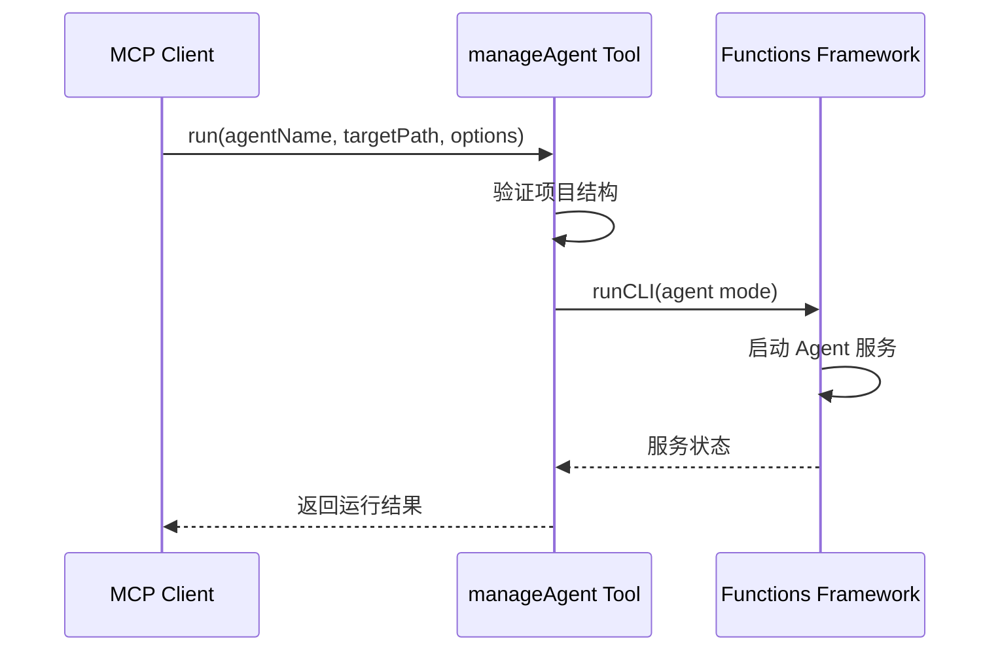

# Agent 功能技术方案设计

## 架构概述

Agent 功能基于现有的云托管工具架构，扩展支持 AI 智能体的开发、部署和管理。采用与云托管工具相同的设计模式，提供查询和管理两个主要工具。

## 技术架构



## 工具设计

### 1. 扩展 queryCloudRun 工具

**功能**：在现有查询功能基础上扩展 Agent 查询

**注意**：由于 CloudBase Manager 目前只提供 `createFunctionAgent` 接口，暂不支持 Agent 查询功能。Agent 查询功能将在后续版本中支持。

**预留操作类型**：
- `agents`: 获取 Agent 列表（待实现）
- `agentDetail`: 获取指定 Agent 详细信息（待实现）

**参数扩展**：
```typescript
// 在现有的 queryCloudRunInputSchema 中扩展
action: z.enum(['list', 'detail', 'templates']), // 暂不添加 agents 和 agentDetail
// 预留 Agent 相关参数（待实现）
// agentName: z.string().optional().describe('Agent名称筛选条件'),
// botId: z.string().optional().describe('BotId筛选条件'),
// detailBotId: z.string().optional().describe('要查询详细信息的BotId'),
```

### 2. 扩展 manageCloudRun 工具

**功能**：在现有管理功能基础上扩展 Agent 管理

**新增操作类型**：
- `createAgent`: 创建新的 Agent
- 复用现有的 `deploy`、`run`、`delete` 操作（支持 Agent 模式）

**参数扩展**：
```typescript
// 在现有的 ManageCloudRunInputSchema 中扩展
action: z.enum(['init', 'download', 'run', 'deploy', 'delete', 'createAgent']),

// 新增 Agent 创建参数
agentConfig: z.object({
  agentName: z.string().describe('Agent名称，用于生成BotId'),
  botTag: z.string().optional().describe('Bot标签，用于生成BotId，不提供时自动生成'),
  description: z.string().optional().describe('Agent描述信息'),
  template: z.string().optional().default('blank').describe('Agent模板类型'),
}).optional().describe('Agent配置项，仅在createAgent操作时使用'),

// 扩展 runOptions 支持 Agent 模式
runOptions: z.object({
  port: z.number().min(1).max(65535).optional().default(3000),
  envParams: z.record(z.string()).optional(),
  runMode: z.enum(['normal', 'agent']).optional().default('normal').describe('运行模式：normal=普通函数，agent=Agent模式'),
  agentId: z.string().optional().describe('Agent ID，在agent模式下使用'),
}).optional(),
```

**Agent 检测逻辑**：
- 检查项目是否包含 `@cloudbase/aiagent-framework` 依赖
- 检查是否有 Agent 相关的代码结构
- 根据检测结果决定使用哪种启动方式

## 核心功能实现

### 1. Agent 创建流程



**实现要点**：
- 调用 `manager.agent.createFunctionAgent()` 创建 Agent
- 在指定目录生成 Agent 项目代码
- 自动安装 `@cloudbase/aiagent-framework` 依赖
- 生成基础的 Agent 代码模板
- 创建 `cloudbaserc.json` 配置文件

### 2. Agent 部署流程



**实现要点**：
- 复用现有的云托管部署逻辑
- 自动设置为函数型服务
- 服务名称使用 BotId 格式
- 更新 `cloudbaserc.json` 配置

### 3. Agent 本地运行流程



**实现要点**：
- 使用 `@cloudbase/functions-framework` 的 Agent 模式
- 支持 watch 模式热重启
- 提供调试面板访问地址
- 支持自定义端口和环境变量

## 代码模板设计

### 基础 Agent 代码模板

```javascript
const { BotRunner, BotCore } = require("@cloudbase/aiagent-framework");

const ANSWER = "你好，我是一个智能体，但我只会说这一句话。";

class MyBot extends BotCore {
  async sendMessage() {
    for (let i = 0; i < ANSWER.length; i++) {
      // 发送消息给客户端
      this.sseSender.send({ data: { content: ANSWER[i] } });
    }
    // 发送完毕
    this.sseSender.end();
  }
}

exports.main = (event, context) =>
  BotRunner.run(event, context, new MyBot(context));
```

### package.json 模板

```json
{
  "name": "function-agent",
  "main": "index.js",
  "scripts": {
    "dev": "tcb cloudrun run --runMode=agent -w",
    "deploy": "tcb cloudrun deploy"
  },
  "dependencies": {
    "@cloudbase/aiagent-framework": "^1.0.0-beta.10"
  }
}
```

## 集成策略

### 1. 与现有工具的集成

- **复用云托管工具**：Agent 部署复用现有的云托管部署逻辑
- **统一配置管理**：使用相同的 `cloudbaserc.json` 配置格式
- **一致的错误处理**：采用相同的错误处理和返回格式

### 2. 命名规范

- **BotId 格式**：`ibot-{agentName}-{botTag}`
- **服务名称**：使用 BotId 作为云托管服务名称
- **目录结构**：`{targetPath}/{agentName}/`

### 3. 配置管理

- **环境变量**：支持通过环境变量配置 Agent 参数
- **配置文件**：自动生成和维护 `cloudbaserc.json`
- **依赖管理**：自动安装和管理 Agent 框架依赖

## 安全考虑

1. **权限控制**：Agent 操作需要相应的云开发权限
2. **输入验证**：严格验证 BotId 格式和参数合法性
3. **删除确认**：删除操作必须要求确认，避免误操作
4. **路径安全**：验证目标路径的安全性，防止路径遍历攻击

## 性能优化

1. **缓存机制**：缓存 Agent 列表和配置信息
2. **异步操作**：长时间操作采用异步处理
3. **批量操作**：支持批量查询和管理操作
4. **资源清理**：及时清理临时文件和进程

## 测试策略

1. **单元测试**：测试工具的核心逻辑
2. **集成测试**：测试与 CloudBase Manager 的集成
3. **端到端测试**：测试完整的 Agent 创建、部署、运行流程
4. **性能测试**：测试工具的性能和稳定性
