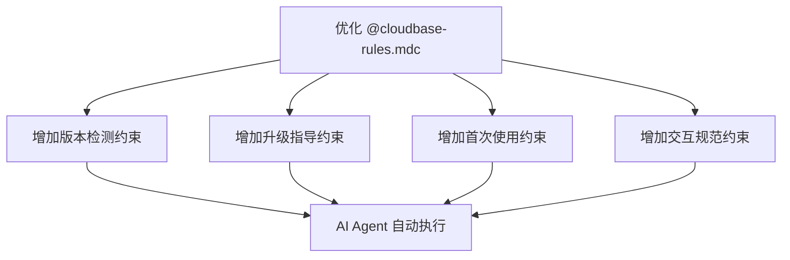
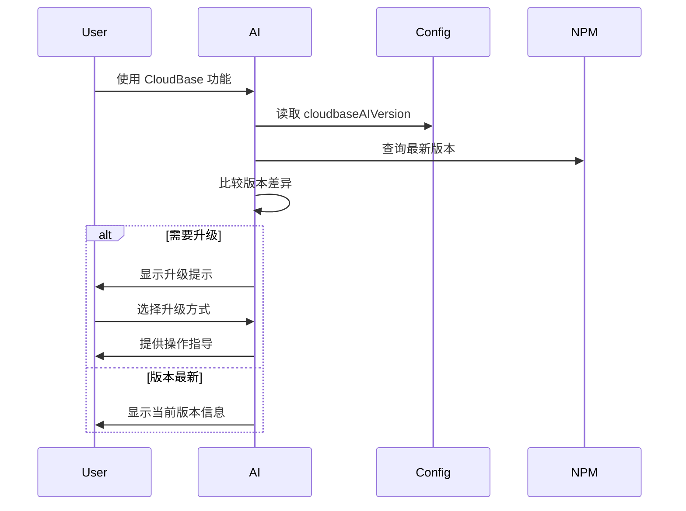

# 技术方案设计

## 架构概述

本方案通过优化 config 中的 @cloudbase-rules.mdc 约束文件，增强 AI Agent 的版本检测和升级提示能力。核心是通过改进提示词指导 AI Agent 自动执行版本检查、升级建议和用户引导功能。

## 技术栈

- **约束文件**: Markdown 格式的规则文件
- **版本检测**: AI Agent 通过 npm registry API 查询
- **用户交互**: interactiveDialog 工具集成
- **文件操作**: AI Agent 的文件读写能力
- **网络请求**: AI Agent 的网络请求能力

## 技术选型

### 提示词优化方案
1. **版本检测提示词**: 指导 AI Agent 自动检查 cloudbaseAIVersion 和最新 npm 版本
2. **升级指导提示词**: 提供结构化的升级操作指导模板
3. **首次使用提示词**: 友好的欢迎信息和版本介绍模板
4. **约束增强提示词**: 确保 AI Agent 遵循项目规范

### 约束文件结构优化
1. **版本管理约束**: 在 @cloudbase-rules.mdc 中增加版本检测和升级相关约束
2. **交互规范约束**: 定义 AI Agent 与用户交互的标准流程
3. **操作安全约束**: 确保文件操作和网络请求的安全性
4. **文档链接约束**: 集成官方文档链接和操作指南

## 约束文件设计

### 版本检测约束

```markdown
## 版本检测和升级约束

### 自动版本检测
- 当用户使用 CloudBase 相关功能时，AI Agent 应自动检查当    
- 通过 npm registry API 查询 @cloudbase/cloudbase-mcp 的最新版本
- 比较版本差异，如果发现新版本可用，主动向用户提示升级建议

### 升级指导流程
- 检测到版本差异时，使用 interactiveDialog 工具与用户确认升级意愿
- 提供详细的升级指导，包括 MCP 升级和 AI 规则下载两个选项
- 集成官方文档链接：https://docs.cloudbase.net/ai/cloudbase-ai-toolkit/faq#%E5%A6%82%E4%BD%95%E6%9B%B4%E6%96%B0-cloudbase-ai-toolkit
- 指导用户执行 downloadTemplate 操作，参数为 template:rules

### 首次使用体验
- 用户首次使用时，显示友好的欢迎信息和当前版本
- 使用适当的 emoji 增强用户体验
- 提供快速开始指南和功能概览
- 主动询问用户是否需要了解升级流程
```

### 交互规范约束

```markdown
## AI Agent 交互规范

### 版本信息展示格式
```
🚀 CloudBase AI Toolkit v{currentVersion}

✨ 当前版本：{currentVersion}
🆕 最新版本：{latestVersion}
📅 最后检查：{lastCheckTime}

{upgradeMessage}
```

### 升级提示格式
```
🔄 发现新版本可用！

当前版本：{currentVersion}
最新版本：{latestVersion}

选择升级方式：
1. 🔧 升级 MCP 工具
2. 📥 下载最新 AI 规则
3. 🚀 全部升级
4. ❌ 暂不升级

官方升级指南：{officialDocLink}
```

### 操作确认格式
- 使用 interactiveDialog 工具进行用户确认
- 提供清晰的操作选项和风险提示
- 确保用户了解操作的影响和后果
```

## 实现策略

### 1. 约束文件增强



### 2. 提示词模板设计



## 测试策略

### 约束验证测试
- 提示词模板语法检查
- 约束文件格式验证
- 链接有效性测试

### 用户体验测试
- AI Agent 响应准确性测试
- 交互流程完整性测试
- 升级指导有效性测试

### 兼容性测试
- 不同 AI IDE 兼容性测试
- 不同操作系统兼容性测试
- 网络环境适应性测试

## 安全性

1. **版本验证**: 确保从官方 npm registry 获取版本信息
2. **操作确认**: 所有重要操作都需要用户确认
3. **文件保护**: 升级过程中保护用户现有配置文件
4. **错误处理**: 完善的错误提示和回滚指导

## 部署和发布

1. **约束文件更新**: 更新 config 目录下的所有规则文件
2. **硬链接同步**: 执行硬链接脚本确保所有 IDE 配置同步
3. **文档更新**: 更新官方文档说明新功能
4. **用户通知**: 通过社区渠道通知用户新功能 