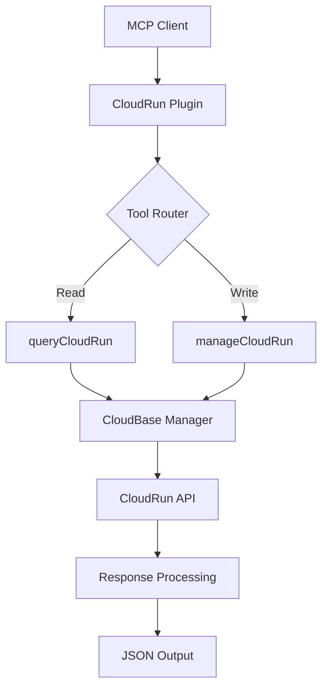

# 云托管插件技术方案设计

## 系统架构

### 插件架构
云托管插件将采用与云函数插件相同的架构模式：
- 使用 `ExtendedMcpServer` 接口集成到 MCP 服务器
- 通过 `getCloudBaseManager()` 获取 CloudBase Manager 实例
- 注册为可选插件，插件名为 `cloudrun`

### 技术栈
- **SDK**: `@cloudbase/manager-node` v4.4.5+
- **API**: CloudBase Manager `cloudrun` 服务
- **校验**: Zod schema 输入验证
- **日志**: CloudBase 统一日志系统

## API 设计

基于读写分离原则，设计2个核心工具：

### 1. queryCloudRun (读操作)
**功能**: 查询云托管服务列表、详情和模板信息
**API**: `cloudbase.cloudrun.list()`, `cloudbase.cloudrun.detail()`, `cloudbase.cloudrun.getTemplates()`

```typescript
interface queryCloudRunInput {
  action: "list" | "detail" | "templates"; // 查询类型
  
  // list 操作参数
  pageSize?: number;      // 每页数量 (默认: 10)
  pageNum?: number;       // 页码 (默认: 1)
  serverName?: string;    // 服务名称筛选 (list时为过滤条件)
  serverType?: "function" | "container"; // 服务类型筛选
  
  // detail 操作参数
  detailServerName?: string; // 获取详情的服务名称 (detail时必填)
}
```

### 2. manageCloudRun (写操作)
**功能**: 管理云托管服务（部署、下载、删除、初始化）
**API**: `cloudbase.cloudrun.deploy()`, `cloudbase.cloudrun.download()`, `cloudbase.cloudrun.delete()`, `cloudbase.cloudrun.init()`

```typescript
interface ManageCloudRunInput {
  action: "deploy" | "download" | "delete" | "init"; // 操作类型
  serverName: string;                                 // 服务名称
  
  // deploy 操作参数
  targetPath?: string;     // 本地代码路径 (绝对路径) - deploy/download/init需要
  serverConfig?: {         // 服务配置 (deploy可选)
    OpenAccessTypes?: string[];  // 开放访问类型
    Cpu?: number;                // CPU规格 (如 0.25, 0.5, 1)
    Mem?: number;                // 内存规格 (如 0.25, 0.5, 1)
    MinNum?: number;             // 最小实例数
    MaxNum?: number;             // 最大实例数
    Port?: number;               // 端口 (容器型服务)
    EnvParams?: Record<string, string>; // 环境变量
    Dockerfile?: string;         // Dockerfile路径
    BuildDir?: string;           // 构建目录
    InternalAccess?: boolean;    // 是否开启内网访问
    EntryPoint?: string;         // 入口文件
    Cmd?: string;               // 启动命令
  };
  
  // init 操作参数
  template?: string;       // 模板名称 (init需要，默认: helloworld)
  
  // 通用参数
  force?: boolean;         // 强制操作，跳过确认 (默认: false)
}
```

## 错误处理策略

### 输入验证
- 使用 Zod schema 严格验证所有输入参数
- 提供清晰的参数格式和必填字段说明
- 路径参数自动转换为绝对路径

### 错误分类
1. **参数错误**: 返回具体的参数验证失败信息
2. **服务错误**: 云托管服务不存在、状态异常等
3. **权限错误**: 环境访问权限、操作权限不足
4. **网络错误**: API 调用失败、超时等
5. **文件系统错误**: 路径不存在、权限不足等

### 用户友好提示
- 英文错误信息，符合项目规范
- 包含解决建议和相关文档链接
- 操作前确认机制（非 force 模式）

## 数据流图



## 性能优化

### 缓存策略
- 服务列表查询结果缓存5分钟
- 服务详情缓存2分钟
- 模板列表缓存30分钟

### 异步处理
- 部署操作支持异步模式
- 长时间操作提供进度反馈
- 大文件上传分片处理

## 安全考虑

### 路径安全
- 严格验证 targetPath 参数，防止路径遍历攻击
- 限制操作范围在当前工作目录及其子目录
- 代码上传前进行基本安全扫描

### 权限控制
- 验证用户对目标环境的操作权限
- 删除操作需要额外确认
- 生产环境操作记录审计日志

## 集成规范

### 插件注册
```typescript
// server.ts 中添加
const AVAILABLE_PLUGINS = {
  // ... existing plugins
  cloudrun: { name: 'cloudrun', register: registerCloudRunTools },
};

const DEFAULT_PLUGINS = [
  'env', 'database', 'functions', 'hosting', 'storage', 
  'setup', 'interactive', 'rag', 'gateway', 'download',
  'security-rule', 'invite-code'
  // cloudrun 不在默认列表中，需要显式启用
];
```

### 环境变量配置
```bash
# 启用云托管插件
export CLOUDBASE_MCP_PLUGINS_ENABLED="env,database,functions,hosting,storage,setup,interactive,rag,gateway,download,cloudrun"

# 或者禁用其他插件只启用云托管
export CLOUDBASE_MCP_PLUGINS_ENABLED="cloudrun"
```

## 测试策略

### 单元测试
- 每个工具函数的参数验证测试
- 错误处理逻辑测试
- Mock CloudBase Manager 的响应测试

### 集成测试
- 真实环境下的服务列表查询测试
- 完整的部署流程测试
- 跨平台兼容性测试

### 性能测试
- 大型项目部署性能测试
- 并发操作稳定性测试
- 内存使用情况监控
