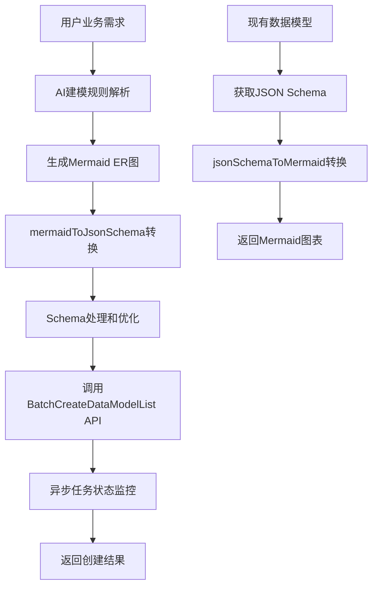

# 技术方案设计

## 架构概述

本功能主要围绕数据模型的AI建模和创建，包含三个核心模块：

1. **AI建模规则系统**：提供完整的Mermaid ER图建模规范
2. **数据模型创建工具**：基于Mermaid描述创建MySQL数据模型
3. **数据模型导出增强**：支持JSON Schema到Mermaid的转换

## 技术栈选择

### 核心依赖
- **@cloudbase/cals@alpha**：提供`mermaidToJsonSchema`和`jsonSchemaToMermaid`转换功能
- **cloudbase-manager-node**：云开发管理SDK，用于模型管理操作
- **zod**：输入参数验证和类型定义

### 现有基础设施
- **MCP Server框架**：复用现有的`ExtendedMcpServer`和工具注册机制
- **CommonService模式**：使用`cloudbase.commonService('lowcode')`调用低代码服务
- **错误处理机制**：沿用现有的标准化错误处理格式

## 数据流设计



## 接口设计

### 新增工具：modifyDataModel

```typescript
interface ModifyDataModelParams {
  mermaidDiagram: string;      // Mermaid classDiagram代码
  action?: 'create' | 'update'; // 操作类型，默认create
  publish?: boolean;           // 是否立即发布，默认false  
}

interface ModifyDataModelResponse {
  success: boolean;
  taskId?: string;             // 异步任务ID
  models?: string[];           // 处理的模型名称列表
  successCount?: number;       // 成功处理的模型数量
  failedCount?: number;        // 失败的模型数量
  message: string;
  error?: string;
}
```

**说明：** 该工具内部会自动轮询任务状态直至完成或超时（30秒），避免用户需要手动查询任务状态。

### 增强工具：manageDataModel

在现有的`get`操作响应中新增`mermaid`字段：

```typescript
interface ManageDataModelGetResponse {
  success: boolean;
  action: 'get';
  data: {
    DbInstanceType: string;
    Title: string;
    Description: string;
    Name: string;
    UpdatedAt: string;
    Schema: {
      userFields: any[];
      relations: any[];
      totalFields: number;
      userFieldsCount: number;
    };
    mermaid?: string;          // 新增：Mermaid ER图表示
  };
  message: string;
}
```

**说明：** 保持向后兼容，在现有返回结构中新增`mermaid`字段，无需修改调用参数。

## 核心算法设计

### 1. Schema处理算法

```typescript
function createBackendSchemaParams(schema: ReturnType<typeof mermaidToJsonSchema>[string]) {
  const commonFields = {
    "x-kind": "tcb",
    "x-defaultMethods": [
      "wedaCreate", "wedaDelete", "wedaUpdate", 
      "wedaGetItem", "wedaGetList", "wedaGetRecords",
      "wedaBatchCreate", "wedaBatchUpdate", "wedaBatchDelete"
    ],
    "x-primary-column": "_id",
  };

  // 优化枚举字段处理
  Object.values(schema.properties).forEach(property => {
    if (property.format === 'enum') {
      property.enum = undefined; // 避免创建过重的枚举
    }

    // 处理数组类型的默认值
    if (Array.isArray(property.default) && property.type !== 'array') {
      if (property.default.length > 0 && property.type === typeof property.default[0]) {
        property.default = property.default[0];
      }
    }
  });

  return Object.assign({}, commonFields, schema);
}
```

### 2. 异步任务监控算法

```typescript
async function waitForTaskCompletion(taskId: string, maxWaitTime = 30000) {
  const startTime = Date.now();
  let status = 'init';
  
  while (status === 'init' && (Date.now() - startTime) < maxWaitTime) {
    const statusRes = await queryTaskStatus(taskId);
    status = statusRes.status;
    
    if (status === 'init') {
      await new Promise(resolve => setTimeout(resolve, 2000)); // 等待2秒
    }
  }
  
  return status;
}
```

## 数据模型设计

### 字段类型支持

云开发数据模型支持多种字段类型，通过Mermaid建模规则中定义的类型映射：

| Mermaid类型 | 说明 |
|-------------|------|
| string | 文本字段 |
| number | 数字字段 |
| boolean | 布尔字段 |
| datetime/date/time | 时间相关字段 |
| x-enum | 枚举字段 |
| x-rtf | 富文本字段 |
| email/phone/url | 带格式验证的文本字段 |
| x-file/x-image | 文件相关字段 |
| x-location | 地理位置字段 |

### 关联关系设计

数据模型间的关联关系通过Schema中的关联字段定义，底层实现由云开发平台处理。

## 安全设计

### 1. 输入验证
- Mermaid语法验证：检查classDiagram格式正确性
- 字段类型验证：确保类型映射在支持范围内
- 关联关系验证：检查关系方向和基数合理性
- 命名规范验证：确保符合数据库命名约定

### 2. 权限控制
- 模型创建权限：需要对应环境的管理权限
- 发布控制：通过publish参数控制模型状态
- 环境隔离：确保操作限制在指定环境内

### 3. 错误处理
- API调用失败：提供详细错误信息和建议
- 任务超时：设置合理的超时时间和重试机制
- 数据冲突：检测模型名称冲突并提供解决方案

## 性能设计

### 1. 异步处理
- 模型创建采用异步任务模式
- 支持批量创建多个模型
- 提供任务状态查询接口

### 2. 缓存策略
- Schema转换结果缓存
- 模型信息本地缓存
- 减少重复API调用

### 3. 资源优化
- 限制单次创建的模型数量
- 合理设置任务超时时间
- 优化Schema处理算法

## 测试策略

### 1. 单元测试
- Schema转换功能测试
- 参数验证测试
- 错误处理测试

### 2. 集成测试
- API调用流程测试
- 异步任务监控测试
- 端到端创建流程测试

### 3. 性能测试
- 大规模模型创建测试
- 并发请求处理测试
- 内存和CPU使用监控

## 部署和维护

### 1. 版本管理
- 支持@cloudbase/cals@alpha版本依赖
- 向后兼容性保证
- 平滑升级策略

### 2. 监控和日志
- 工具调用次数统计
- 错误率监控
- 性能指标采集

### 3. 文档和培训
- API文档更新
- 使用示例提供
- 最佳实践指导

## 风险评估

### 1. 技术风险
- @cloudbase/cals库的稳定性（alpha版本）
- API接口变更风险
- 性能瓶颈风险

### 2. 业务风险
- 用户输入的Mermaid图表复杂度过高
- 数据模型设计不合理
- 与现有系统的兼容性问题

### 3. 缓解措施
- 充分的测试验证
- 渐进式功能发布
- 完善的错误处理和用户提示
- 详细的使用文档和最佳实践指导 