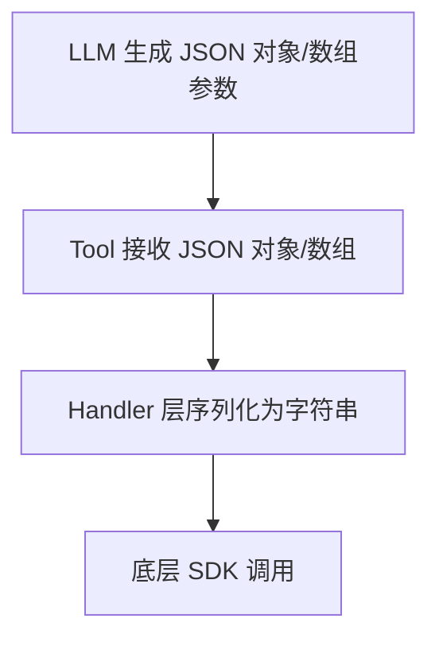

# 技术方案设计

## 架构与技术选型
- 现有数据库相关 tool（如 insertDocuments、updateDocuments 等）部分参数采用 json 字符串作为入参，需调整为直接 JSON 对象/数组。
- tool handler/manager 层负责将 JSON 对象/数组序列化为字符串，再调用底层 SDK。

## 主要改动点
1. Tool 参数类型调整：
   - 例如 insertDocuments 的 documents 字段，从 string[]（每个元素为 JSON 字符串）调整为 object[]（每个元素为 JSON 对象）。
2. Handler 层序列化处理：
   - 在 handler 层将 object[] 序列化为 string[]，兼容底层 SDK。
3. 文档与注释同步更新：
   - 明确参数类型、示例和注意事项。
4. 回归测试：
   - 增加典型嵌套 JSON 场景的单元测试。

## Mermaid 架构图

