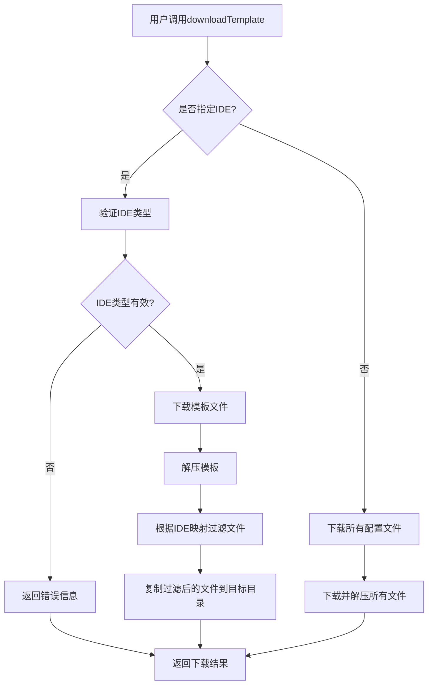

# 技术方案设计

## 架构概述

在现有的 `downloadTemplate` 工具基础上，增加IDE特定的文件过滤功能，通过配置文件映射关系表实现按需下载。

## 技术栈

- TypeScript
- Node.js fs/promises API
- Zod 类型验证
- 现有的模板下载和解压逻辑

## 技术选型

### 1. IDE映射关系表设计

```typescript
interface IDEMapping {
  ide: string;
  description: string;
  configFiles: string[];
  directories?: string[];
}

const IDE_MAPPINGS: IDEMapping[] = [
  {
    ide: "cursor",
    description: "Cursor AI编辑器",
    configFiles: [
      ".cursor/rules/cloudbase-rules.mdc",
      ".cursor/mcp.json"
    ],
    directories: [".cursor/"]
  },
  {
    ide: "windsurf",
    description: "WindSurf AI编辑器",
    configFiles: [
      ".windsurf/rules/cloudbase-rules.md"
    ],
    directories: [".windsurf/"]
  },
  {
    ide: "codebuddy",
    description: "CodeBuddy AI编辑器",
    configFiles: [
      ".rules/cloudbase-rules.md"
    ],
    directories: [".rules/"]
  },
  {
    ide: "claude-code",
    description: "Claude Code AI编辑器",
    configFiles: [
      "CLAUDE.md",
      ".mcp.json"
    ],
    directories: [""]
  },
  {
    ide: "cline",
    description: "Cline AI编辑器",
    configFiles: [
      ".clinerules/cloudbase-rules.mdc"
    ],
    directories: [".clinerules/"]
  },
  {
    ide: "gemini-cli",
    description: "Gemini CLI",
    configFiles: [
      ".gemini/GEMINI.md",
      ".gemini/settings.json"
    ],
    directories: [".gemini/"]
  },
  {
    ide: "opencode",
    description: "OpenCode AI编辑器",
    configFiles: [
      ".opencode.json"
    ],
    directories: [""]
  },
  {
    ide: "qwen-code",
    description: "通义灵码",
    configFiles: [
      ".qwen/QWEN.md",
      ".qwen/settings.json"
    ],
    directories: [".qwen/"]
  },
  {
    ide: "baidu-comate",
    description: "百度Comate",
    configFiles: [
      ".comate/rules/cloudbaase-rules.mdr",
      ".comate/mcp.json"
    ],
    directories: [".comate/"]
  },
  {
    ide: "openai-codex-cli",
    description: "OpenAI Codex CLI",
    configFiles: [
      ".codex/rules/cloudbase-rules.md"
    ],
    directories: [".codex/"]
  },
  {
    ide: "augment-code",
    description: "Augment Code",
    configFiles: [
      ".augment-guidelines"
    ],
    directories: [""]
  },
  {
    ide: "github-copilot",
    description: "GitHub Copilot",
    configFiles: [
      ".github/copilot-instructions.md"
    ],
    directories: [".github/"]
  },
  {
    ide: "roocode",
    description: "RooCode AI编辑器",
    configFiles: [
      ".roo/rules/cloudbaase-rules.md",
      ".roo/mcp.json"
    ],
    directories: [".roo/"]
  },
  {
    ide: "tongyi-lingma",
    description: "通义灵码",
    configFiles: [
      ".lingma/rules/cloudbaase-rules.md"
    ],
    directories: [".lingma/"]
  },
  {
    ide: "trae",
    description: "Trae AI编辑器",
    configFiles: [
      ".trae/rules/cloudbase-rules.md"
    ],
    directories: [".trae/"]
  },
  {
    ide: "vscode",
    description: "Visual Studio Code",
    configFiles: [
      ".vscode/mcp.json",
      ".vscode/settings.json"
    ],
    directories: [".vscode/"]
  }
];
```

### 2. 文件过滤机制

- 在解压模板后，根据用户指定的IDE类型过滤文件
- 只保留该IDE相关的配置文件和目录
- 保持项目基础结构不变

### 3. 参数扩展

在现有的 `downloadTemplate` 工具中增加可选参数：
- `ide`: 指定要下载的IDE类型，使用枚举类型，默认值为 "all"
- 保持 `template` 和 `overwrite` 参数不变

```typescript
// IDE类型枚举
const IDE_TYPES = [
  "all",           // 下载所有IDE配置（默认）
  "cursor",        // Cursor AI编辑器
  "windsurf",      // WindSurf AI编辑器
  "codebuddy",     // CodeBuddy AI编辑器
  "claude-code",   // Claude Code AI编辑器
  "cline",         // Cline AI编辑器
  "gemini-cli",    // Gemini CLI
  "opencode",      // OpenCode AI编辑器
  "qwen-code",     // 通义灵码
  "baidu-comate",  // 百度Comate
  "openai-codex-cli", // OpenAI Codex CLI
  "augment-code",  // Augment Code
  "github-copilot", // GitHub Copilot
  "roocode",       // RooCode AI编辑器
  "tongyi-lingma", // 通义灵码
  "trae",          // Trae AI编辑器
  "vscode"         // Visual Studio Code
] as const;
```

## 数据库/接口设计

无需数据库，纯文件操作。

## 测试策略

### 1. 单元测试
- **IDE映射关系测试**：验证每个IDE的配置文件路径是否正确
- **IDE验证函数测试**：测试 `validateIDE` 函数的各种输入情况
- **文件过滤函数测试**：测试 `filterFilesByIDE` 函数的过滤逻辑

### 2. 集成测试
- **完整下载流程测试**：测试指定IDE时的完整下载和解压流程
- **文件过滤结果验证**：验证下载的文件只包含指定IDE的配置
- **错误处理测试**：测试无效IDE类型的错误处理

### 3. 兼容性测试
- **向后兼容性测试**：确保未指定IDE时下载所有配置文件
- **参数组合测试**：测试不同参数组合的兼容性

### 4. 测试用例设计
```typescript
// 测试用例示例
describe('downloadTemplate IDE filtering', () => {
  test('should download all files when ide is "all"', async () => {
    // 测试默认行为
  });
  
  test('should download only cursor files when ide is "cursor"', async () => {
    // 测试特定IDE过滤
  });
  
  test('should throw error for invalid ide type', async () => {
    // 测试错误处理
  });
  
  test('should maintain backward compatibility', async () => {
    // 测试向后兼容性
  });
});
```

## 安全性

- 文件路径验证，防止路径遍历攻击
- 文件类型白名单验证
- 临时文件清理机制

## 实现流程图



## 文件结构变更

```
mcp/src/tools/setup.ts
├── IDE_MAPPINGS 常量定义
├── filterFilesByIDE 函数
├── validateIDE 函数
└── 修改 downloadTemplate 工具
``` 