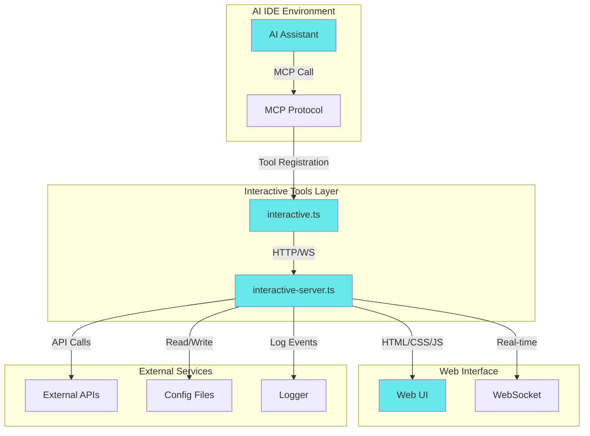
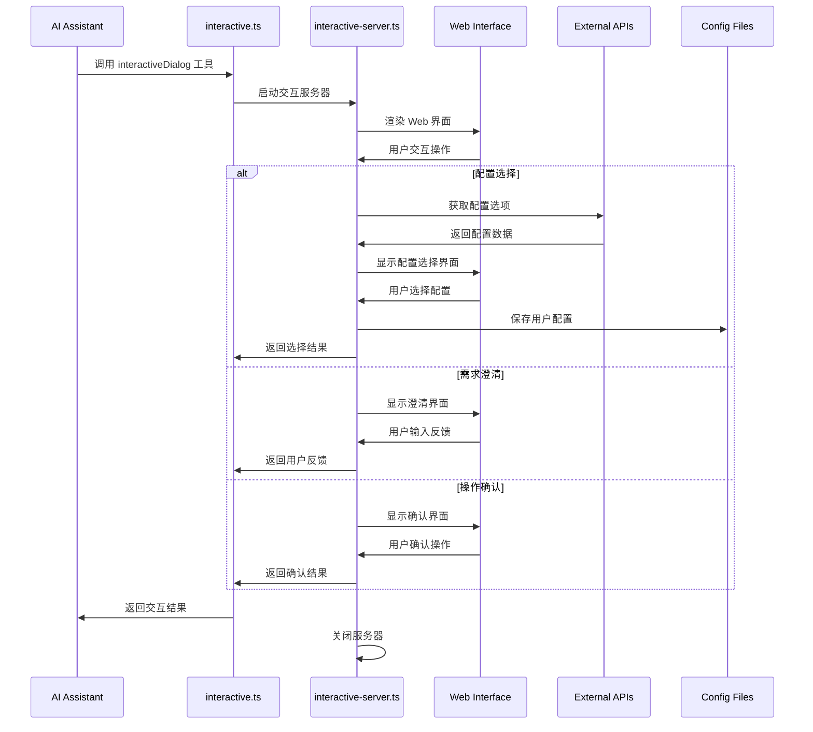
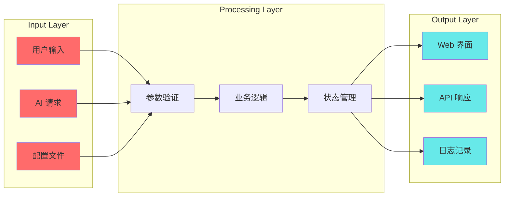
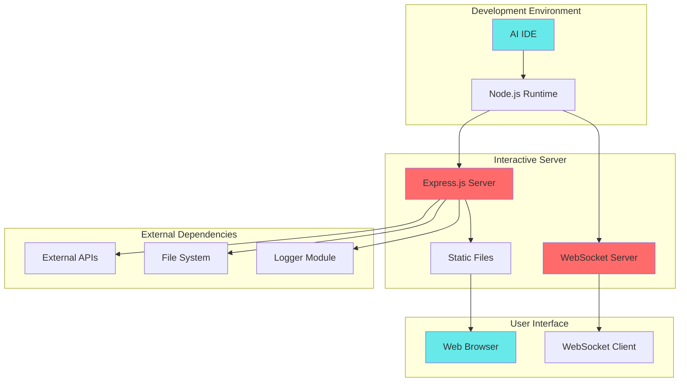

# 技术方案设计

## 架构概述

MCP 交互式工具模块采用客户端-服务器架构，包含两个核心组件：

1. **interactive.ts** - MCP 工具接口层，负责注册工具和提供 MCP 协议接口
2. **interactive-server.ts** - 交互式服务器，负责提供 Web 界面和用户交互逻辑

整个系统采用单例模式管理服务器实例，确保资源高效利用和状态一致性。该模块为 MCP 协议提供了强大的用户交互能力，让 AI 助手能够与用户进行实时、直观的沟通。

### 系统架构图



### 组件交互流程图



### 数据流图



### 部署架构图



## 技术栈

- **后端框架**: Express.js + WebSocket
- **前端技术**: HTML5 + CSS3 + JavaScript (原生)
- **通信协议**: HTTP + WebSocket
- **文件系统**: Node.js fs/promises
- **日志系统**: 自定义 logger 模块
- **浏览器控制**: open 模块

## 技术选型

### 服务器架构
- **Express.js**: 轻量级 Web 框架，适合快速构建交互界面
- **WebSocket**: 实时双向通信，支持动态交互
- **单例模式**: 确保服务器实例唯一性，避免资源冲突

### 前端界面
- **原生 JavaScript**: 无需额外依赖，加载速度快
- **CSS Grid/Flexbox**: 响应式布局，适配不同屏幕尺寸
- **CSS 动画**: 提供流畅的用户体验
- **JetBrains Mono 字体**: 代码友好的等宽字体

### 配置管理
- **JSON 格式**: 人类可读的配置文件格式
- **用户主目录**: 跨平台兼容的配置存储位置
- **版本控制**: 配置文件版本管理，支持向后兼容

## 数据库/接口设计

### 配置文件结构
```json
{
  "envId": "your-env-id",
  "updatedAt": "2024-01-01T00:00:00.000Z",
  "version": "1.0"
}
```

### API 接口设计

#### 配置选择接口
```typescript
interface ConfigSelectionRequest {
  type: 'config';
  data: string; // 配置选项
}

interface ConfigSelectionResponse {
  success: boolean;
  error?: string;
}
```

#### 需求澄清接口
```typescript
interface ClarificationRequest {
  type: 'clarification';
  data: string; // 用户输入
}

interface ClarificationResponse {
  success: boolean;
  error?: string;
}
```

#### 操作确认接口
```typescript
interface ConfirmationRequest {
  type: 'confirmation';
  data: {
    confirmed: boolean;
    option: string;
  };
}

interface ConfirmationResponse {
  success: boolean;
  error?: string;
}
```

### WebSocket 消息格式
```typescript
interface WebSocketMessage {
  type: 'config' | 'clarification' | 'confirmation';
  data: any;
  cancelled?: boolean;
}
```

## 核心功能实现

### 1. 统一交互式对话工具

#### MCP 工具注册
```typescript
server.registerTool("interactiveDialog", {
  title: "交互式对话",
  description: "统一的交互式对话工具，支持需求澄清和任务确认",
  inputSchema: {
    type: z.enum(['clarify', 'confirm']),
    message: z.string().optional(),
    options: z.array(z.string()).optional(),
    forceUpdate: z.boolean().optional(),
    risks: z.array(z.string()).optional()
  }
});
```

#### 交互类型处理
- **clarify**: 需求澄清，支持预设选项和自定义输入
- **confirm**: 任务确认，支持风险提示和确认选项

### 2. 配置管理

#### 自动配置选择逻辑
```typescript
async function _promptAndSetConfig(autoSelectSingle: boolean): Promise<{
  selectedConfig: string | null;
  cancelled: boolean;
  error?: string;
  noConfigs?: boolean;
}> {
  // 1. 检查配置状态
  // 2. 获取配置选项
  // 3. 自动选择或用户选择
  // 4. 保存配置
}
```

#### 配置文件管理
- **存储位置**: `~/.mcp-interactive-config`
- **格式**: JSON
- **版本控制**: 支持配置迁移和兼容性检查

### 3. Web 界面设计

#### 配置选择界面
- **现代化设计**: 深色主题，毛玻璃效果
- **响应式布局**: 适配不同屏幕尺寸
- **动画效果**: 流畅的过渡动画
- **交互反馈**: 实时状态更新

#### 需求澄清界面
- **预设选项**: 快速选择常用选项
- **自定义输入**: 支持详细描述
- **实时验证**: 输入内容验证

#### 操作确认界面
- **风险提示**: 突出显示操作风险
- **确认选项**: 明确的确认/取消选项
- **自动提交**: 选择后自动提交

### 4. 服务器管理

#### 端口管理策略
```typescript
private readonly DEFAULT_PORT = 3721;
private readonly FALLBACK_PORTS = [3722, 3723, ..., 3735];

async start(): Promise<number> {
  // 1. 尝试默认端口
  // 2. 端口被占用时尝试备用端口
  // 3. 所有端口都不可用时抛出错误
}
```

#### 资源清理机制
```typescript
private cleanup() {
  if (this.isRunning) {
    this.server.close();
    this.wss.close();
    this.isRunning = false;
  }
}
```

### 5. 多IDE兼容性

#### CodeBuddy 特殊处理
```typescript
async function openUrl(url: string, options?: any, server?: any) {
  if (process.env.INTEGRATION_IDE === 'CodeBuddy' && server) {
    // 发送通知而不是打开浏览器
    server.server.sendLoggingMessage({
      level: "notice",
      data: { type: "tcb", url: url }
    });
  } else {
    // 默认行为：打开浏览器
    await open(url, options);
  }
}
```

## 测试策略

### 1. 单元测试
- **工具注册测试**: 验证 MCP 工具正确注册
- **配置管理测试**: 验证配置文件读写功能
- **错误处理测试**: 验证异常情况处理

### 2. 集成测试
- **服务器启动测试**: 验证服务器启动和端口管理
- **Web界面测试**: 验证界面渲染和交互功能
- **API接口测试**: 验证接口响应和错误处理

### 3. 端到端测试
- **完整交互流程**: 验证从工具调用到用户交互的完整流程
- **多环境测试**: 验证在不同 IDE 环境中的兼容性
- **性能测试**: 验证服务器性能和资源使用

## 安全性

### 1. 输入验证
- **参数验证**: 使用 Zod 进行严格的参数验证
- **XSS 防护**: 对用户输入进行转义处理
- **CSRF 防护**: 使用会话验证防止跨站请求伪造

### 2. 资源管理
- **端口隔离**: 使用本地端口，避免外部访问
- **会话管理**: 会话超时和自动清理
- **资源限制**: 限制并发连接数和请求频率

### 3. 错误处理
- **异常捕获**: 完整的异常处理机制
- **错误日志**: 详细的错误记录和追踪
- **优雅降级**: 在错误情况下提供备用方案

## 性能优化

### 1. 服务器优化
- **连接池管理**: 复用 HTTP 和 WebSocket 连接
- **内存管理**: 及时清理不需要的数据
- **超时处理**: 设置合理的超时时间

### 2. 前端优化
- **资源压缩**: CSS 和 JavaScript 代码压缩
- **缓存策略**: 静态资源缓存
- **懒加载**: 按需加载非关键资源

### 3. 配置优化
- **配置文件缓存**: 减少文件系统访问
- **批量操作**: 合并多个配置操作
- **异步处理**: 非阻塞的配置操作

## 监控和日志

### 1. 日志记录
- **操作日志**: 记录用户操作和系统响应
- **错误日志**: 记录异常和错误信息
- **性能日志**: 记录性能指标和资源使用

### 2. 监控指标
- **服务器状态**: 运行状态和端口使用
- **交互统计**: 交互次数和成功率
- **错误率**: 错误发生频率和类型

### 3. 调试功能
- **实时日志查看**: Web 界面查看系统日志
- **状态监控**: 实时监控服务器状态
- **配置检查**: 验证配置文件完整性
