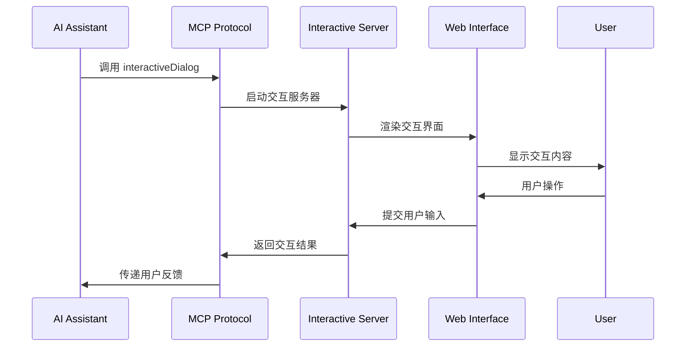

# MCP 交互特性说明

## 概述

MCP (Model Context Protocol) 交互式工具模块为 AI 助手提供了强大的用户交互能力，让 AI 能够在需要用户确认、澄清或选择时，通过现代化的 Web 界面与用户进行实时沟通。

## 核心交互特性

### 1. MCP 工具注册

#### 工具定义
```typescript
// MCP 工具注册示例
server.registerTool("interactiveDialog", {
  title: "交互式对话",
  description: "统一的交互式对话工具，支持需求澄清和任务确认",
  inputSchema: {
    type: z.enum(['clarify', 'confirm']),
    message: z.string().optional(),
    options: z.array(z.string()).optional(),
    forceUpdate: z.boolean().optional(),
    risks: z.array(z.string()).optional()
  }
});
```

#### 交互类型
- **clarify**: 需求澄清 - 当 AI 需要用户提供更多信息时使用
- **confirm**: 任务确认 - 当 AI 需要用户确认敏感操作时使用

### 2. 实时交互流程

#### 交互启动
1. AI 助手调用 `interactiveDialog` 工具
2. 系统自动启动交互式服务器
3. 浏览器打开交互界面
4. 用户进行交互操作
5. 结果返回给 AI 助手

#### 交互模式


### 3. 用户界面特性

#### 现代化设计
- **深色主题**: 符合开发者偏好
- **毛玻璃效果**: 现代化的视觉体验
- **响应式布局**: 适配不同屏幕尺寸
- **流畅动画**: CSS 动画和过渡效果

#### 交互组件
- **预设选项**: 快速选择常用选项
- **自定义输入**: 支持详细描述
- **风险提示**: 突出显示操作风险
- **确认按钮**: 明确的确认/取消选项

### 4. 多IDE兼容性

#### CodeBuddy IDE 特殊处理
```typescript
// CodeBuddy IDE 兼容性处理
if (process.env.INTEGRATION_IDE === 'CodeBuddy' && server) {
  // 使用通知机制而不是打开浏览器
  server.server.sendLoggingMessage({
    level: "notice",
    data: { type: "tcb", url: url }
  });
} else {
  // 默认浏览器打开
  await open(url, options);
}
```

#### 支持的 IDE 环境
- **CodeBuddy**: 使用通知机制
- **Cursor**: 默认浏览器打开
- **VS Code**: 默认浏览器打开
- **其他 MCP 兼容 IDE**: 自动适配

### 5. 配置管理

#### 配置文件结构
```json
{
  "configId": "user-selected-config",
  "updatedAt": "2024-01-01T00:00:00.000Z",
  "version": "1.0",
  "preferences": {
    "theme": "dark",
    "language": "zh-CN",
    "autoSave": true
  }
}
```

#### 配置操作
- **自动加载**: 启动时自动加载上次配置
- **持久化存储**: 用户选择自动保存
- **版本管理**: 支持配置版本升级
- **清理功能**: 提供配置重置选项

### 6. 错误处理和日志

#### 错误处理机制
```typescript
try {
  const result = await interactiveServer.clarifyRequest(message, options);
  if (result.cancelled) {
    return { content: [{ type: "text", text: "用户取消了交互" }] };
  }
  return { content: [{ type: "text", text: `用户反馈: ${result.data}` }] };
} catch (error) {
  return { content: [{ type: "text", text: `交互出错: ${error.message}` }] };
}
```

#### 日志记录
- **操作日志**: 记录用户交互操作
- **错误日志**: 记录异常和错误信息
- **性能日志**: 记录响应时间和资源使用
- **调试日志**: 支持实时日志查看

## 使用场景

### 1. 需求澄清场景
```typescript
// AI 需要澄清用户需求
await interactiveDialog({
  type: 'clarify',
  message: '请详细描述您想要实现的功能，包括具体的业务逻辑和用户界面要求。',
  options: [
    '用户登录注册系统',
    '数据管理界面',
    '文件上传下载',
    '其他功能'
  ]
});
```

### 2. 操作确认场景
```typescript
// AI 需要用户确认敏感操作
await interactiveDialog({
  type: 'confirm',
  message: '即将删除数据库中的所有用户数据，此操作不可恢复。',
  risks: [
    '所有用户数据将被永久删除',
    '此操作不可撤销',
    '可能影响系统正常运行'
  ],
  options: [
    '确认删除',
    '取消操作',
    '先备份数据'
  ]
});
```

### 3. 配置选择场景
```typescript
// AI 需要用户选择配置选项
await interactiveDialog({
  type: 'clarify',
  message: '请选择您偏好的开发框架和数据库类型。',
  options: [
    'React + MongoDB',
    'Vue + MySQL',
    'Angular + PostgreSQL',
    '自定义配置'
  ]
});
```

## 技术优势

### 1. 协议标准化
- **MCP 协议**: 遵循 Model Context Protocol 标准
- **工具注册**: 标准化的工具注册机制
- **参数验证**: 使用 Zod 进行类型安全验证
- **错误处理**: 统一的错误处理机制

### 2. 用户体验优化
- **实时交互**: WebSocket 支持实时双向通信
- **现代化界面**: 美观的 Web 界面设计
- **响应式设计**: 适配不同设备和屏幕
- **无障碍支持**: 支持键盘导航和屏幕阅读器

### 3. 开发体验优化
- **单例模式**: 避免资源冲突和重复启动
- **自动管理**: 服务器自动启动和关闭
- **端口管理**: 智能端口选择和冲突处理
- **调试支持**: 完整的日志和调试功能

### 4. 扩展性设计
- **模块化架构**: 清晰的模块分离
- **插件化设计**: 支持新的交互类型
- **配置化**: 支持自定义配置和主题
- **多语言**: 支持国际化扩展

## 最佳实践

### 1. 交互设计原则
- **简洁明了**: 交互内容要简洁易懂
- **选项合理**: 预设选项要覆盖常见情况
- **风险提示**: 敏感操作要明确提示风险
- **取消机制**: 始终提供取消选项

### 2. 错误处理原则
- **优雅降级**: 错误时提供备用方案
- **用户友好**: 错误信息要用户友好
- **日志记录**: 详细记录错误信息
- **恢复机制**: 提供错误恢复选项

### 3. 性能优化原则
- **按需启动**: 只在需要时启动服务器
- **资源清理**: 及时清理不需要的资源
- **缓存机制**: 合理使用缓存提升性能
- **并发控制**: 控制并发连接数量

## 未来规划

### 1. 功能增强
- [ ] 支持更多交互类型（文件选择、日期选择等）
- [ ] 添加语音交互支持
- [ ] 支持多语言界面
- [ ] 添加自定义主题支持

### 2. 技术升级
- [ ] 支持 WebRTC 实时通信
- [ ] 添加 PWA 支持
- [ ] 实现离线交互能力
- [ ] 支持移动端优化

### 3. 生态扩展
- [ ] 提供更多 IDE 插件
- [ ] 支持第三方工具集成
- [ ] 建立交互组件库
- [ ] 提供开发者 SDK

## 总结

MCP 交互式工具模块为 AI 助手提供了强大而灵活的用户交互能力，通过现代化的 Web 界面、标准化的 MCP 协议和完善的错误处理机制，让 AI 能够与用户进行自然、高效的沟通。该模块不仅提升了用户体验，也为 MCP 生态系统的发展做出了重要贡献。
