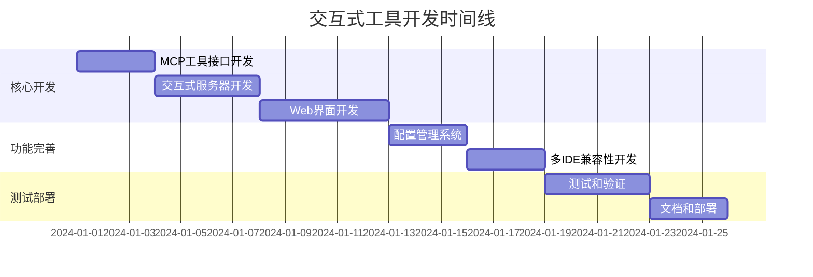

# 实施计划

## 任务概览

本实施计划涵盖了交互式工具模块的完整开发流程，包括需求分析、设计实现、测试验证和部署维护等各个阶段。

## 核心任务

### 任务 1 - MCP 工具接口开发
**优先级**: 高  
**预计工时**: 2-3 天  
**负责人**: 开发团队

#### 具体要做的事情
- [ ] 实现 `interactive.ts` 中的 MCP 工具注册逻辑
- [ ] 实现 `interactiveDialog` 工具的输入参数验证
- [ ] 实现交互类型处理逻辑（clarify/confirm）
- [ ] 集成配置管理功能
- [ ] 添加错误处理和日志记录

#### 验收标准
- [ ] MCP 工具能够正确注册到服务器
- [ ] 参数验证能够捕获无效输入
- [ ] 交互类型处理逻辑正确
- [ ] 配置管理功能完整
- [ ] 错误处理机制完善

#### 相关需求
- 需求 1: 统一交互式对话工具
- 需求 2: 配置管理功能
- 需求 6: 错误处理和日志

### 任务 2 - 交互式服务器开发
**优先级**: 高  
**预计工时**: 3-4 天  
**负责人**: 开发团队

#### 具体要做的事情
- [ ] 实现 Express.js 服务器框架
- [ ] 实现 WebSocket 服务器
- [ ] 实现端口管理和自动选择逻辑
- [ ] 实现会话管理和数据存储
- [ ] 实现资源清理和错误恢复机制

#### 验收标准
- [ ] 服务器能够正常启动和关闭
- [ ] 端口管理逻辑正确
- [ ] WebSocket 连接稳定
- [ ] 会话数据正确管理
- [ ] 资源清理机制有效

#### 相关需求
- 需求 4: 服务器管理
- 需求 6: 错误处理和日志

### 任务 3 - Web 界面开发
**优先级**: 中  
**预计工时**: 4-5 天  
**负责人**: 前端开发

#### 具体要做的事情
- [ ] 设计并实现环境选择界面
- [ ] 设计并实现需求澄清界面
- [ ] 设计并实现操作确认界面
- [ ] 实现响应式布局和动画效果
- [ ] 实现用户交互逻辑和状态管理

#### 验收标准
- [ ] 界面设计现代化且美观
- [ ] 响应式布局适配不同屏幕
- [ ] 动画效果流畅自然
- [ ] 用户交互逻辑正确
- [ ] 状态管理机制完善

#### 相关需求
- 需求 3: Web界面交互

### 任务 4 - 配置管理系统
**优先级**: 中  
**预计工时**: 2-3 天  
**负责人**: 开发团队

#### 具体要做的事情
- [ ] 实现配置文件读写功能
- [ ] 实现配置版本管理
- [ ] 实现配置迁移和兼容性检查
- [ ] 实现配置清理和重置功能
- [ ] 添加配置验证和错误处理

#### 验收标准
- [ ] 配置文件能够正确读写
- [ ] 版本管理机制有效
- [ ] 配置迁移功能正常
- [ ] 配置清理功能完整
- [ ] 配置验证机制完善

#### 相关需求
- 需求 2: 配置管理功能
- 需求 7: 配置管理

### 任务 5 - 多IDE兼容性开发
**优先级**: 中  
**预计工时**: 2-3 天  
**负责人**: 开发团队

#### 具体要做的事情
- [ ] 实现 CodeBuddy IDE 特殊处理逻辑
- [ ] 实现环境检测和适配机制
- [ ] 实现浏览器打开的回退策略
- [ ] 添加其他 IDE 的兼容性支持
- [ ] 实现通知机制和错误处理

#### 验收标准
- [ ] CodeBuddy IDE 兼容性正常
- [ ] 环境检测机制准确
- [ ] 回退策略有效
- [ ] 其他 IDE 支持完整
- [ ] 通知机制正常工作

#### 相关需求
- 需求 5: 多IDE兼容性

### 任务 6 - 测试和验证
**优先级**: 高  
**预计工时**: 3-4 天  
**负责人**: 测试团队

#### 具体要做的事情
- [ ] 编写单元测试用例
- [ ] 编写集成测试用例
- [ ] 编写端到端测试用例
- [ ] 进行性能测试和压力测试
- [ ] 进行安全测试和漏洞扫描

#### 验收标准
- [ ] 单元测试覆盖率 > 80%
- [ ] 集成测试通过率 100%
- [ ] 端到端测试通过率 100%
- [ ] 性能指标满足要求
- [ ] 安全测试无高危漏洞

#### 相关需求
- 所有需求点

### 任务 7 - 文档和部署
**优先级**: 中  
**预计工时**: 2-3 天  
**负责人**: 技术文档团队

#### 具体要做的事情
- [ ] 编写用户使用文档
- [ ] 编写开发者文档
- [ ] 编写 API 文档
- [ ] 准备部署脚本和配置
- [ ] 进行部署测试和验证

#### 验收标准
- [ ] 用户文档清晰易懂
- [ ] 开发者文档完整详细
- [ ] API 文档准确无误
- [ ] 部署脚本可用
- [ ] 部署测试通过

#### 相关需求
- 所有需求点

## 实施时间线

## 风险评估和缓解措施

### 风险 1: 端口冲突问题
**风险等级**: 中  
**影响**: 服务器启动失败  
**缓解措施**: 
- 实现多端口自动选择机制
- 添加端口检测和冲突处理
- 提供手动端口配置选项

### 风险 2: 浏览器兼容性问题
**风险等级**: 中  
**影响**: 用户界面显示异常  
**缓解措施**: 
- 使用现代浏览器特性检测
- 提供降级方案和兼容性处理
- 进行多浏览器测试

### 风险 3: 性能问题
**风险等级**: 低  
**影响**: 响应速度慢  
**缓解措施**: 
- 实现资源优化和缓存机制
- 进行性能测试和优化
- 监控系统资源使用情况

### 风险 4: 安全漏洞
**风险等级**: 高  
**影响**: 系统安全风险  
**缓解措施**: 
- 实现输入验证和过滤
- 进行安全测试和代码审查
- 定期更新依赖包

## 质量保证

### 代码质量
- [ ] 遵循项目代码规范
- [ ] 使用 TypeScript 进行类型检查
- [ ] 使用 ESLint 进行代码检查
- [ ] 使用 Prettier 进行代码格式化
- [ ] 进行代码审查

### 测试质量
- [ ] 单元测试覆盖率 > 80%
- [ ] 集成测试覆盖主要功能
- [ ] 端到端测试覆盖用户场景
- [ ] 性能测试满足要求
- [ ] 安全测试无漏洞

### 文档质量
- [ ] 代码注释完整
- [ ] API 文档准确
- [ ] 用户文档清晰
- [ ] 开发者文档详细
- [ ] 部署文档完整

## 验收标准

### 功能验收
- [ ] 所有需求功能正常工作
- [ ] 用户交互流程完整
- [ ] 错误处理机制有效
- [ ] 配置管理功能完整
- [ ] 多IDE兼容性正常

### 性能验收
- [ ] 服务器启动时间 < 3秒
- [ ] 页面加载时间 < 2秒
- [ ] 内存使用 < 100MB
- [ ] CPU使用率 < 30%
- [ ] 并发用户支持 > 10

### 安全验收
- [ ] 输入验证有效
- [ ] XSS 防护有效
- [ ] CSRF 防护有效
- [ ] 权限控制正确
- [ ] 日志记录完整

### 兼容性验收
- [ ] 支持主流浏览器
- [ ] 支持不同操作系统
- [ ] 支持不同 IDE 环境
- [ ] 支持不同网络环境
- [ ] 向后兼容性良好
