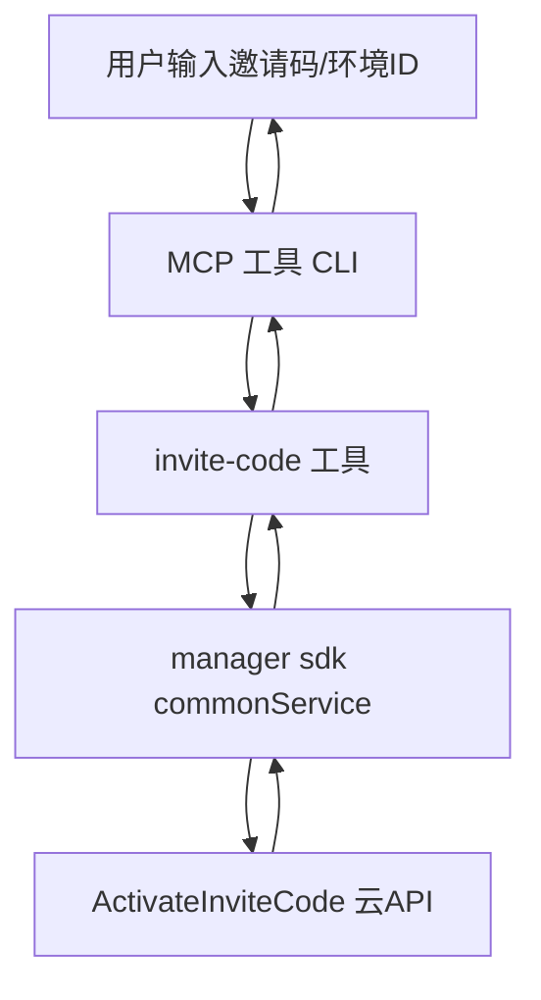

# 技术方案设计

## 架构概述

- 前端（MCP 工具/CLI）负责收集用户输入（InviteCode、EnvId），调用 mcp/tools/invite-code.ts 工具方法。
- invite-code 工具方法通过 manager sdk 的 commonService 调用 ActivateInviteCode 云 API。
- 云 API 返回激活结果及错误信息，MCP 工具根据返回内容提示用户。

## 技术选型
- 语言：TypeScript
- 依赖：现有 manager sdk、commonService
- 入口：mcp/tools/invite-code.ts 新增工具方法

## API 调用方式
- 通过 manager sdk 的 commonService.invoke("ActivateInviteCode", { InviteCode, EnvId }) 实现
- 处理 API 返回的 ErrorCode、ErrorMsg 字段，按需提示用户

## MCP tool 设计要点
- 校验用户输入，缺失参数时直接提示
- 调用 commonService，捕获异常并友好提示
- 根据 ErrorCode/Msg 分类处理常见错误，其他错误统一提示“激活失败，请稍后重试”
- 保持与其他 tools 代码风格一致，便于维护

## 安全性与测试
- 不涉及敏感数据存储
- 需覆盖参数校验、API 异常、各类错误码分支的单元测试 