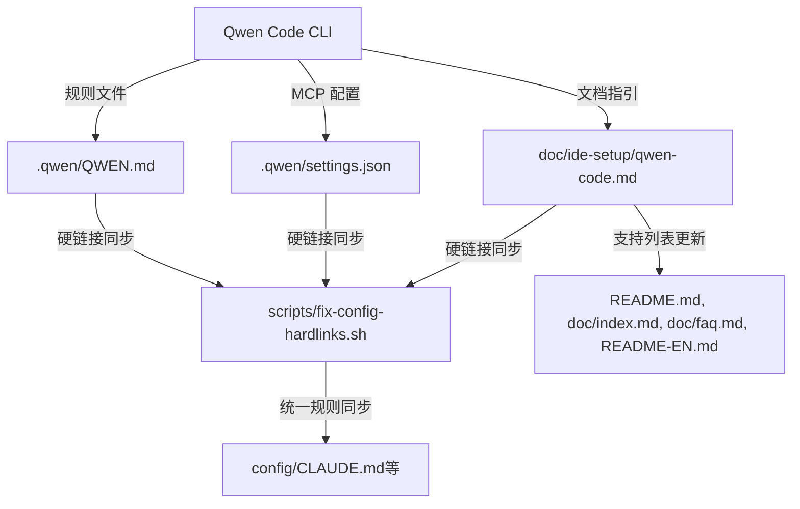

# 技术方案设计

## 架构概述

本方案旨在为 CloudBase AI Toolkit 项目适配 Qwen Code AI IDE，参考 Gemini CLI 适配方式，确保规则文件、MCP 服务器配置、文档、硬链接等机制完整支持。



## 技术选型与实现要点

1. **规则文件支持**
   - 规则文件路径为 `.qwen/QWEN.md`，内容结构参考 CLAUDE.md，支持 Qwen Code 解析。
   - 需在硬链接脚本中加入 `.qwen/QWEN.md` 目标，确保与 config/CLAUDE.md 等规则文件同步。

2. **MCP 服务器配置**
   - 支持在 `.qwen/settings.json` 文件中配置 `mcpServers`，结构如下：

```json
{
  "mcpServers": {
    "serverName": {
      "command": "path/to/server",
      "args": ["--arg1", "value1"],
      "env": {
        "API_KEY": "$MY_API_TOKEN"
      },
      "cwd": "./server-directory",
      "timeout": 30000,
      "trust": false
    }
  }
}
```
   - 文档需给出完整配置示例，便于用户复制。

3. **IDE 配置文档**
   - 在 `doc/ide-setup/qwen-code.md` 编写 Qwen Code 配置与使用说明，内容包括：
     - 快速安装与环境要求（Node.js 20+）
     - 规则文件与 MCP 配置说明
     - 与 Gemini CLI 的异同点
     - API Key 获取与计费说明

4. **硬链接与同步机制**
   - 更新 `scripts/fix-config-hardlinks.sh`，将 `.qwen/QWEN.md` 及相关配置加入硬链接目标。
   - 执行脚本后，确保 config/ 及 .qwen/ 下规则文件同步。

5. **文档与支持列表更新**
   - 在 `README.md`、`doc/index.md`、`doc/faq.md`、`README-EN.md` 等文档中补充 Qwen Code 支持说明。
   - 英文文档同步，banner 保持英文。

6. **兼容性与扩展性**
   - 适配方式与 Gemini CLI 保持一致，便于后续维护。
   - 若 Qwen Code 后续有特有功能，可扩展文档与规则文件说明。

## 安全性与测试策略

- 规则文件与配置文件仅在本地项目目录生效，无远程同步风险。
- MCP 服务器配置涉及 API Key，建议文档中提醒用户妥善保管密钥。
- 适配完成后，需在本地 Qwen Code 环境下全流程测试（规则文件识别、MCP 配置、文档跳转、硬链接同步等）。 