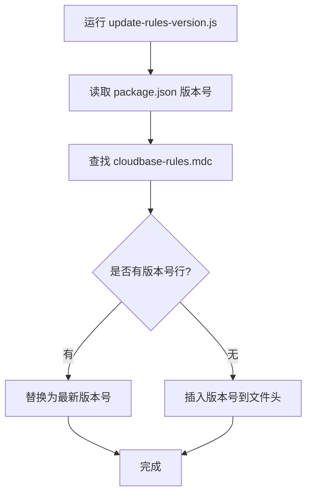

# 技术方案设计

## 1. 插件结构
- 新增 `mcp/src/tools/security-rule.ts`，实现安全规则相关 Tool。
- 在 MCP 工具注册表中默认启用该插件。
- 参考 `database.ts` 的实现风格，采用统一的 Tool 注册与参数校验方式。

## 2. Tool 设计

### Tool 1: 读取安全规则
- 方法名：`readSecurityRule`
- 功能：读取指定资源（数据库集合、云函数、存储桶）的安全规则和权限类别。
- 支持资源类型：`database`、`function`、`storage`
- 参数：
  - `resourceType` (string, 必填)：资源类型，枚举值见下。
  - `resourceId` (string, 必填)：资源唯一标识。数据库为集合名，云函数为函数名，存储为桶名。
  - `envId` (string, 必填)：环境 ID。
- 返回值：
  - `aclTag` (string)：权限类别，见下。
  - `rule` (string|null)：自定义安全规则内容，若为简易权限则为 null。
  - `raw` (object)：接口原始返回。
- 错误处理：参数校验失败、资源不存在、接口异常时返回详细错误信息。

### Tool 2: 写入安全规则
- 方法名：`writeSecurityRule`
- 功能：设置指定资源（数据库集合、云函数、存储桶）的安全规则。
- 支持资源类型：`database`、`function`、`storage`
- 参数：
  - `resourceType` (string, 必填)：资源类型，枚举值见下。
  - `resourceId` (string, 必填)：资源唯一标识。数据库为集合名，云函数为函数名，存储为桶名。
  - `envId` (string, 必填)：环境 ID。
  - `aclTag` (string, 必填)：权限类别，见下。
  - `rule` (string, 可选)：自定义安全规则内容，仅当 `aclTag` 为 `CUSTOM` 时必填。
- 返回值：
  - `requestId` (string)：请求唯一标识。
  - `raw` (object)：接口原始返回。
- 错误处理：参数校验失败、资源不存在、接口异常时返回详细错误信息。

## 3. 权限类别与资源类型枚举

### 权限类别（AclTag）
- `READONLY`：所有用户可读，仅创建者和管理员可写
- `PRIVATE`：仅创建者及管理员可读写
- `ADMINWRITE`：所有用户可读，仅管理员可写
- `ADMINONLY`：仅管理员可读写
- `CUSTOM`：自定义安全规则（需传 rule 字段）

### 资源类型（resourceType）
- `database`：数据库集合
- `function`：云函数
- `storage`：存储桶

## 4. 参数与类型定义

```ts
/** 权限类别 */
export type AclTag = 'READONLY' | 'PRIVATE' | 'ADMINWRITE' | 'ADMINONLY' | 'CUSTOM';

/** 资源类型 */
export type ResourceType = 'database' | 'function' | 'storage';

/** 读取安全规则参数 */
export interface ReadSecurityRuleParams {
  resourceType: ResourceType;
  resourceId: string;
  envId: string;
}

/** 写入安全规则参数 */
export interface WriteSecurityRuleParams {
  resourceType: ResourceType;
  resourceId: string;
  envId: string;
  aclTag: AclTag;
  rule?: string;
}
```

## 5. 接口调用映射

- database:
  - 读：`DescribeSafeRule`（自定义）/`DescribeDatabaseACL`（简易权限）
  - 写：`ModifySafeRule`（自定义）/`ModifyDatabaseACL`（简易权限）
- function:
  - 读：`DescribeSecurityRule`
  - 写：`ModifySecurityRule`
- storage:
  - 读：`DescribeStorageSafeRule`
  - 写：`ModifyStorageSafeRule`

## 6. 错误处理
- 参数缺失、类型错误、枚举非法时，抛出详细错误。
- 云 API 返回异常时，返回原始错误信息。
- 不支持的 resourceType 返回明确错误。

## 7. 其他说明
- Tool 注册时补充详细注释，便于大模型理解。
- 参数说明、枚举说明需在 Tool 描述和类型定义中体现。
- 代码风格与 `database.ts` 保持一致，便于维护和扩展。 

# 技术方案：rules 模板版本号集成（最终版）

## 目标
1. 在 rules 模板（cloudbase-rules.mdc 文件）中插入版本号，格式为“版本号：x.y.z”，x.y.z 取自 mcp/package.json。
2. 在 downloadTemplate 工具描述中，补充说明 rules 模板会包含版本号信息，并在描述中内嵌当前版本号。

---

## 方案细节

### 1. 用脚本自动更新 cloudbase-rules.mdc 版本号
- 新增脚本 scripts/update-rules-version.js。
- 脚本读取 mcp/package.json 的 version 字段。
- 查找 cloudbase-rules.mdc 文件，自动插入或替换“版本号：x.y.z”文本。
- 可在发版、模板更新或需要时运行，保证版本号同步。

### 2. 工具描述内嵌版本号
- 在 mcp/src/tools/setup.ts 的 downloadTemplate 工具 description 字符串中，直接拼接版本号。
- 采用构建时注入的 __MCP_VERSION__（如 telemetry.ts 用法），如：
  ```js
  description: `...（当前版本：${__MCP_VERSION__}）...`
  ```
- 这样用户在工具描述中可直接看到当前 rules 模板版本。

### 3. 兼容性与幂等性
- 版本号维护完全自动化，无需每次下载时动态处理。
- 仅对 rules 模板生效，其他模板不受影响。

---

## Mermaid 流程图


---

## 影响范围
- 仅影响 rules 模板版本号维护流程。
- 其他模板和功能不受影响。
- downloadTemplate 工具描述需同步更新。 