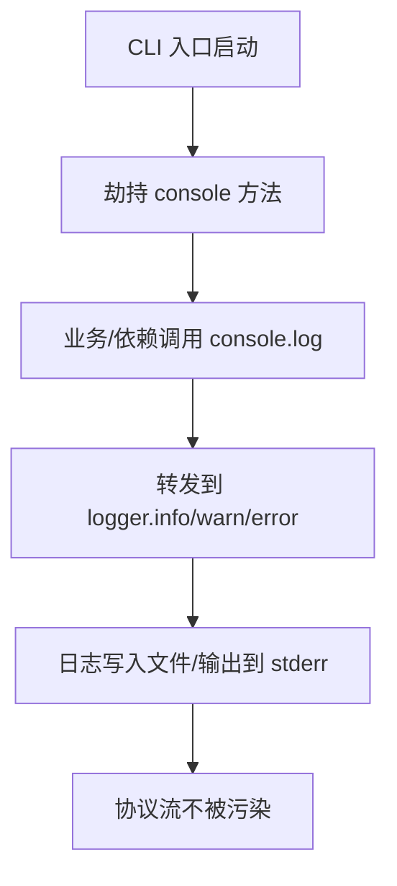

# 技术方案设计

## 1. 方案概述

- 在 mcp CLI 入口（如 mcp/src/cli.ts）最早期执行阶段，劫持全局 console 方法（log、info、warn、error）。
- 劫持后，所有 console.log/console.info 调用转发到 logger.info，console.warn 转发到 logger.warn，console.error 转发到 logger.error。
- 劫持后，原 console 方法不再直接输出到 stdout，避免污染 stdio 协议流。
- 劫持逻辑仅在 CLI 入口生效，不影响其它入口（如本地开发、测试等）。
- logger.ts 已支持日志级别、文件、stderr 输出等能力，兼容现有日志管理。

## 2. 具体实现

### 2.1 劫持方式

- 在 cli.ts 入口文件顶部插入劫持代码，优先于其它依赖和业务逻辑。
- 保存原始 console 方法（如 console._originLog），便于调试或特殊场景恢复。
- 劫持后，console.log/console.info/console.warn/console.error 的所有参数拼接为字符串，传递给 logger。

### 2.2 代码示例

```ts
// mcp/src/cli.ts 顶部
import { info, warn, error } from './utils/logger';

const joinArgs = (...args: any[]) => args.map(a => {
  if (typeof a === 'string') return a;
  try { return JSON.stringify(a); } catch { return String(a); }
}).join(' ');

console._originLog = console.log;
console._originInfo = console.info;
console._originWarn = console.warn;
console._originError = console.error;

console.log = (...args) => info(joinArgs(...args));
console.info = (...args) => info(joinArgs(...args));
console.warn = (...args) => warn(joinArgs(...args));
console.error = (...args) => error(joinArgs(...args));
```

### 2.3 兼容性与异常处理

- 劫持后如 logger 抛出异常，需兜底处理，避免影响主流程。
- joinArgs 保证所有类型参数都能被安全拼接。
- 劫持逻辑不影响 logger.ts 的日志级别、文件、stderr 输出等配置。

### 2.4 其它说明

- 劫持逻辑无需配置开关，始终生效。
- 若后续需调试原始 console，可通过 console._originLog 恢复。

## 3. 流程图



## 4. 安全性与测试

- 劫持后需验证所有日志均未输出到 stdout。
- 需测试依赖包/业务代码大量日志输出场景，协议流不被污染。
- logger.ts 的日志级别、文件、stderr 输出等功能需正常。 