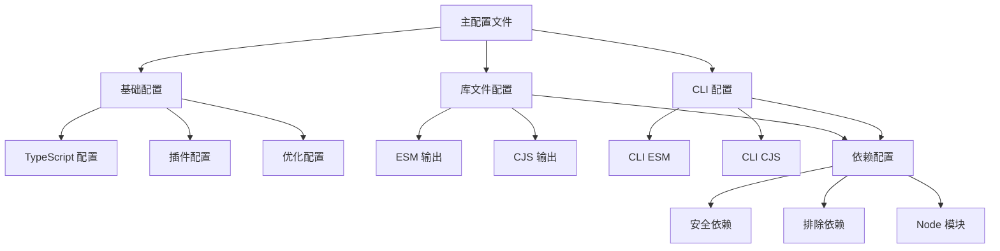

# 技术方案设计

## 架构概述

采用模块化的 webpack 配置架构，将复杂的单文件配置拆分为多个独立的配置文件，实现配置的复用和维护性。

## 技术栈

- **构建工具**: Webpack 5
- **语言**: TypeScript
- **模块格式**: CommonJS + ESM
- **配置管理**: 模块化配置文件

## 技术选型

### 配置模块化策略
- 使用配置文件分离模式，将不同目标的配置独立
- 采用基础配置继承机制，减少重复代码
- 使用 webpack-merge 进行配置合并

### 依赖打包策略
- 使用 webpack-node-externals 进行最小化外部依赖管理
- 实现递归依赖分析，最大化打包覆盖率
- 建立最小排除列表，只排除真正无法打包的依赖

### 多格式输出策略
- 使用 webpack 的 experiments.outputModule 支持 ESM 输出
- 为不同格式创建独立的配置
- 使用 BannerPlugin 为 CLI 添加 shebang

## 数据库/接口设计

### 配置文件结构
```
webpack/
├── base.config.js          # 基础配置
├── externals.config.js     # 外部依赖配置
├── library.config.js       # 库文件配置
├── cli.config.js          # CLI 配置
└── index.js               # 主配置文件
```

### 依赖管理配置
- `minimal-externals.js`: 最小化外部依赖列表
- `node-modules.js`: Node.js 内置模块列表
- `problematic-deps.js`: 真正无法打包的问题依赖

## 测试策略

1. **构建测试**: 验证所有配置能正常构建
2. **格式测试**: 验证 CJS 和 ESM 格式的正确性
3. **依赖测试**: 验证依赖打包的完整性
4. **功能测试**: 验证 CLI 和 lib 的功能正常

## 安全性

- 只排除真正无法打包或存在严重兼容性问题的依赖
- 使用最小排除机制，最大化打包覆盖率
- 保持 Node.js 内置模块的外部化

## 架构图



## 实施计划

1. **第一阶段**: 创建模块化配置文件结构
2. **第二阶段**: 实现基础配置和依赖管理
3. **第三阶段**: 创建库文件和 CLI 配置
4. **第四阶段**: 测试和优化
5. **第五阶段**: 文档更新和清理 