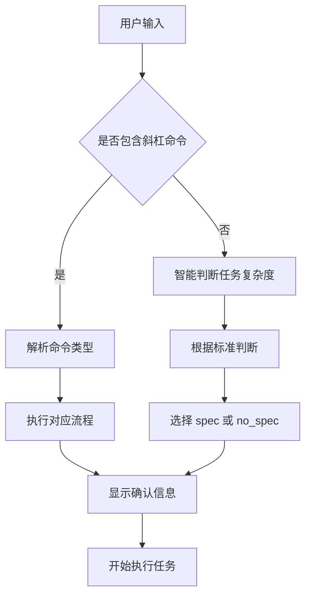
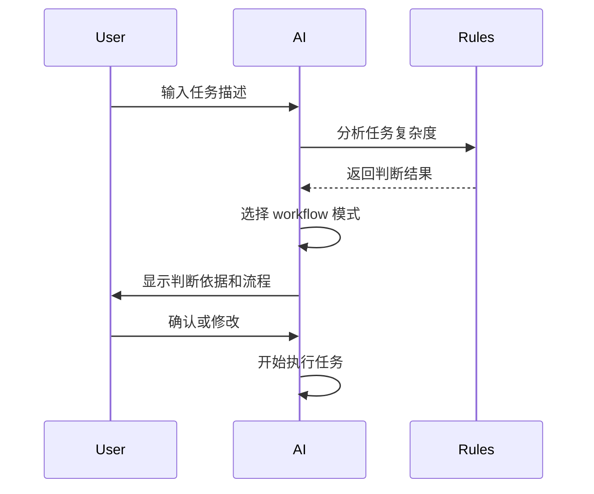

# 技术方案设计

## 架构概述

本方案通过优化 workflow 约束，将现有的工作流规范改造成斜杠命令的形式，提供灵活的开发模式选择。核心是通过增强 AI Agent 的命令识别和智能判断能力，实现用户友好的开发流程控制。

## 技术栈

- **约束文件**: Markdown 格式的规则文件
- **命令识别**: AI Agent 的文本解析能力
- **智能判断**: 基于任务复杂度的逻辑判断
- **用户交互**: interactiveDialog 工具集成
- **流程控制**: 条件化的 workflow 执行

## 技术选型

### 斜杠命令设计
1. **`/spec`** - 强制使用完整 spec 流程
2. **`/no_spec`** - 跳过 spec 流程，直接执行
3. **`/help`** 或 **`/workflow`** - 显示命令帮助
4. **默认智能判断** - 根据任务复杂度自动选择

### 智能判断标准
1. **使用 spec 的场景**：
   - 新功能开发
   - 复杂架构设计
   - 多模块集成
   - 涉及数据库设计
   - 涉及用户界面设计
   - 涉及第三方服务集成

2. **跳过 spec 的场景**：
   - 简单 bug 修复
   - 文档更新
   - 配置修改
   - 代码重构
   - 性能优化
   - 测试用例编写

## 约束文件设计

### 斜杠命令约束

```markdown
## Workflow 斜杠命令规范

### 可用命令
- **/spec** - 强制使用完整 spec 流程（需求文档、技术方案、任务拆分）
- **/no_spec** - 跳过 spec 流程，直接执行任务
- **/help** 或 **/workflow** - 显示 workflow 命令帮助
- **默认** - AI 根据任务复杂度智能判断

### 智能判断标准
**使用 spec 流程的场景：**
- 新功能开发
- 复杂架构设计
- 多模块集成
- 涉及数据库设计
- 涉及用户界面设计
- 涉及第三方服务集成

**跳过 spec 流程的场景：**
- 简单 bug 修复
- 文档更新
- 配置修改
- 代码重构
- 性能优化
- 测试用例编写

### 命令响应格式
```
🎯 Workflow 模式：{mode}

📋 判断依据：{reason}
🔄 后续流程：{next_steps}

{confirmation_message}
```

### 帮助信息格式
```
🛠️ Workflow 命令帮助

📝 可用命令：
• /spec - 强制使用完整 spec 流程
• /no_spec - 跳过 spec 流程，直接执行
• /help 或 /workflow - 显示此帮助信息

💡 使用建议：
• 新功能开发建议使用 /spec
• 简单修复可以直接使用 /no_spec
• 不确定时可以不指定命令，AI 会智能判断

⚠️ 注意事项：
• /no_spec 模式仍需要遵循项目规范
• 复杂任务建议使用 /spec 确保质量
• 任何模式下都需要用户确认重要操作
```
```

### 流程控制约束

```markdown
## 流程执行规范

### Spec 流程（/spec 或智能判断使用）
1. 需求澄清和确认
2. 需求文档设计（requirements.md）
3. 技术方案设计（design.md）
4. 任务拆分（tasks.md）
5. 执行任务并更新状态
6. 用户确认每个阶段

### No-Spec 流程（/no_spec 或智能判断跳过）
1. 直接分析任务需求
2. 快速制定执行计划
3. 直接执行任务
4. 保持代码质量和项目规范
5. 必要时使用 interactiveDialog 确认

### 通用规范
- 所有模式下都必须遵循项目代码规范
- 所有模式下都必须使用英文注释和提交信息
- 所有模式下都必须使用 interactiveDialog 进行重要操作确认
- 所有模式下都必须保持代码质量和可维护性
```

## 实现策略

### 1. 命令识别流程



### 2. 智能判断流程



## 测试策略

### 命令识别测试
- 斜杠命令解析准确性测试
- 智能判断逻辑测试
- 边界情况处理测试

### 用户体验测试
- 命令响应速度测试
- 帮助信息完整性测试
- 流程切换流畅性测试

### 兼容性测试
- 与现有 workflow 兼容性测试
- 不同任务类型适应性测试
- 错误处理机制测试

## 安全性

1. **命令验证**: 确保只识别预定义的斜杠命令
2. **流程保护**: 确保 no_spec 模式下仍保持代码质量
3. **用户确认**: 重要操作仍需用户确认
4. **错误处理**: 完善的错误提示和回退机制

## 部署和发布

1. **约束文件更新**: 更新 config 目录下的所有规则文件
2. **硬链接同步**: 执行硬链接脚本确保所有 IDE 配置同步
3. **文档更新**: 更新官方文档说明新功能
4. **用户通知**: 通过社区渠道通知用户新功能 